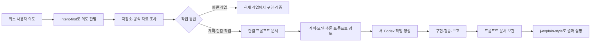

# j-token-workflow-kit

`j-token-workflow-kit`은 사용자가 최소한의 의도만 전달해도 Codex가 저장소와 필요한 외부 자료를 조사하고, 실행 계획과 새 작업용 프롬프트까지 준비하는 한국어 워크플로우 플러그인입니다.

현재 플러그인 버전: `1.1.0`

다이어그램은 실행 환경에 맞게 출력합니다. Codex Desktop에서는 Mermaid를 사용하고, Codex CLI에서는 Mermaid를 `text` 코드 블록 안의 ASCII 다이어그램으로 대체합니다.

## 1.1.0에서 달라진 점

1.1.0은 1.0.0의 작업 분류를 유지하면서 로컬 브라우저 검토를 사실 관계, 옵션 선택, 계획 검토의 세 단계로 확장합니다.

- GFM Markdown, Mermaid, KaTeX 수식과 다크·라이트 테마를 로컬 자산으로 렌더링합니다.
- 사실 수정, 단일·다중 옵션, 직접 입력, 본문·블록·전역 코멘트와 피드백 재시작 흐름을 제공합니다.
- `gpt-5.6` 모델을 모달에서 선택하고 LLM의 모델 선택 이유를 읽기 전용으로 확인합니다.

- 빠른 작업: 문서를 만들지 않고 사용자의 현재 실행 요청에 따라 같은 작업에서 구현·검증합니다.
- 계획 작업: `.codex/prompts/active/<slug>.md` 한 파일에 사실, 조건, 결정, 계획, 검증, 모델, 추론 강도와 실행 프롬프트를 모읍니다.
- 민감 작업: 프롬프트 문서는 하나로 유지하고 삭제, 배포, 외부 전송, 권한 변경과 비가역 데이터 변경 직전에만 별도 승인을 받습니다.
- PRD, 기술 스펙과 독립 감사는 사용자가 명시적으로 요구하거나 외부 형식·고위험 계약에 실제로 필요할 때만 추가합니다.

## 작동 방식

모든 사용자 명령은 먼저 `intent-first`를 거칩니다. 이 단계에서 저장소를 보면 알 수 있는 지식 공백은 직접 조사하고, 실제 사용자 선택이 필요한 의도 공백만 질문합니다. 작업 결과나 새로운 지식을 사용자에게 설명할 때는 `j-explain-style`로 설명 순서를 구성합니다.



## Codex 실행 프롬프트 문서

```text
.codex/prompts/
├── README.md
├── active/<slug>.md
├── supporting/<slug>/<명시적으로-요청된-문서>.md
└── archive/YYYY/<slug>.md
```

`README.md`는 상태·유형·태그·갱신일로 찾는 카탈로그입니다. 한 작업의 권위 있는 실행 프롬프트는 `active/<slug>.md` 하나이며, 완료되면 내용을 복제하지 않고 상태를 갱신해 `archive/YYYY/`로 옮깁니다. `supporting/`은 사용자가 별도 PRD·기술 스펙을 요청한 경우에만 사용합니다. 최초 프롬프트 생성에서는 카탈로그와 프롬프트 문서로 실제 파일 2개가 생기고, 이후 작업마다 프롬프트 문서 1개를 추가하며 카탈로그를 갱신합니다.

프롬프트 문서에는 다음 정보가 함께 들어갑니다.

- 의도와 완료 상태
- 범위와 비범위
- 확인된 사실, 추정과 근거
- 조건, 결정과 기각한 대안
- 단계별 구현·검증 계획
- 권장 모델, 추론 강도와 선택 사유
- 새 Codex 작업에 그대로 전달할 완전한 프롬프트
- 결과와 후속

모델과 추론 강도는 사용자가 새 작업을 승인하기 전에 수정할 수 있습니다. 승인 후 Codex 앱의 새 작업 도구가 있으면 해당 설정으로 작업을 만들고, 없거나 실패하면 동일한 모델·추론 강도·프롬프트를 코드 블록으로 출력합니다.

## OS별 바이너리

`codex-workflow` 바이너리는 프롬프트 문서를 로컬 브라우저에서 열고 세 단계로 검토합니다.

1. **사실 관계**: AI가 확인한 팩트와 근거를 읽고, 틀린 내용을 한 번에 수정하거나 원문으로 되돌립니다.
2. **옵션 선택**: 질문별로 단일 또는 다중 옵션을 선택하고 직접 입력이나 선택별 의견을 덧붙입니다.
3. **계획 검토**: GFM Markdown, 상호작용 Mermaid와 KaTeX LaTeX 수식으로 렌더링한 계획에서 본문 드래그, 표·Mermaid 블록 전체 또는 상단 버튼으로 코멘트를 남깁니다. 다크·라이트 테마를 전환하고 모달에서 `gpt-5.6` 모델을 선택하며 LLM의 모델 선택 이유를 읽기 전용으로 확인할 수 있습니다.

코멘트가 있으면 승인 버튼이 비활성화되고 `피드백 보내기`가 나타납니다. 피드백은 LLM에 반환되며, LLM이 영향 범위에 따라 `facts`, `choices`, `plan` 중 다시 시작할 단계를 선택합니다. 코멘트가 없을 때만 계획을 승인할 수 있고, 수정한 사실과 선택 결과는 승인된 프롬프트의 `[사용자 검토 결과]`에 자동으로 포함됩니다. 서버는 `127.0.0.1`의 임의 포트에만 바인딩되며 외부 스크립트나 네트워크 UI 자산을 사용하지 않습니다.

| 운영체제 | 아키텍처 | 릴리스 파일 |
| --- | --- | --- |
| macOS | Apple Silicon | `codex-workflow-darwin-arm64` |
| macOS | Intel | `codex-workflow-darwin-x64` |
| Linux | arm64 | `codex-workflow-linux-arm64` |
| Linux | x64 | `codex-workflow-linux-x64` |
| Windows | arm64 | `codex-workflow-windows-arm64.exe` |
| Windows | x64 | `codex-workflow-windows-x64.exe` |

각 릴리스 파일에는 같은 이름의 `.sha256` sidecar가 함께 생성됩니다.

macOS와 Linux:

```sh
curl -fsSL https://raw.githubusercontent.com/j-token/j-token-codex-workflow-kit/main/scripts/install.sh | sh
```

Windows PowerShell:

```powershell
irm https://raw.githubusercontent.com/j-token/j-token-codex-workflow-kit/main/scripts/install.ps1 | iex
```

특정 버전 설치:

```sh
curl -fsSL https://raw.githubusercontent.com/j-token/j-token-codex-workflow-kit/v1.1.0/scripts/install.sh | sh -s -- --version 1.1.0
```

```powershell
& ([scriptblock]::Create((irm https://raw.githubusercontent.com/j-token/j-token-codex-workflow-kit/v1.1.0/scripts/install.ps1))) -Version 1.1.0
```

위 설치 URL은 `v1.1.0` tag와 GitHub Release가 게시된 뒤부터 사용할 수 있습니다. 설치 스크립트와 바이너리 버전을 함께 고정하므로 이후 `main`의 변경에 영향을 받지 않습니다.

프롬프트 검토:

```text
codex-workflow review .codex/prompts/active/<slug>.md --json
```

피드백을 반영한 뒤 특정 단계에서 다시 검토할 때는 다음처럼 실행합니다.

```text
codex-workflow review .codex/prompts/active/<slug>.md --start-at=choices --json
```

결과는 `status`, `path`, `model`, `reasoningEffort`, `prompt`, `facts`, `selections`, `comments`를 가진 JSON으로 stdout에 반환됩니다. `status: feedback`이면 `restartOptions`도 반환되며 LLM이 코멘트를 반영하고 재시작 단계를 선택합니다. 브라우저를 자동으로 열 수 없는 환경에서는 stderr에 표시된 로컬 URL을 직접 열 수 있습니다.

## 사용 예시

간단한 수정은 그대로 요청합니다.

```text
이 오타를 고치고 관련 테스트를 실행해줘.
```

조사와 별도 실행 작업이 필요한 목표는 프롬프트로 준비합니다.

```text
$setup-codex-prompt를 사용해 이 아이디어를 저장소와 공식 자료에서 조사하고 새 Codex 작업용 프롬프트를 만들어줘.
```

계획을 본 뒤 모델과 추론 강도를 바꿀 수 있습니다.

```text
모델은 gpt-5.6-sol, 추론 강도는 high로 바꾸고 이 계획으로 새 작업 시작해줘.
```

## 포함된 스킬

| 스킬 | 역할 |
| --- | --- |
| `intent-first` | 모든 사용자 명령에서 가장 먼저 의도를 판별하고, 조사·가정·질문 중 적절한 경로를 선택합니다. |
| `j-explain-style` | 사용자에게 작업 결과나 지식을 설명할 때 J의 정보 배치 순서와 실측 중심 설명 방식을 적용합니다. |
| `setup-codex-prompt` | 최소 의도에서 사실·조건·계획·모델·추론 강도·실행 프롬프트를 단일 프롬프트 문서로 만듭니다. |
| `requirements-to-spec` | 거친 요구사항을 조사해 Codex 실행 프롬프트로 수렴시키고, 명시적으로 필요한 경우에만 보조 문서를 연결합니다. |
| `start-implementation-thread` | 승인된 모델·추론 강도·실행 프롬프트로 새 Codex 작업을 만들고 실패 시 같은 내용을 출력합니다. |
| `bug-report-to-fix` | 간단한 버그는 바로 수정하고 복잡한 버그만 실행 프롬프트 준비 흐름으로 올립니다. |
| `figma-flow-to-implementation` | UI 흐름과 에셋을 조사하고 작업 등급에 따라 바로 구현하거나 프롬프트로 계획합니다. |
| `workflow-composer` | 요구사항, 버그와 UI 작업을 조합하되 산출물을 단일 Codex 실행 프롬프트로 수렴시킵니다. |
| `prd-writer` | 명시적으로 요청된 장기 제품 범위 문서를 작성합니다. |
| `technical-spec-writer` | 명시적으로 요청된 장기 공개 기술 계약을 작성합니다. |
| `audit-technical-spec` | 명시 요청 또는 고위험 계약에만 독립 감사를 적용합니다. |
| `orchestrate-subagents` | 독립 병렬화나 검토 이점이 있는 작업만 하위 에이전트에 배정합니다. |
| `prototype-design` | 확정 전 아이디어를 Mermaid나 프로토타입으로 보여줍니다. |
| `cognitive-writing` | 사용자 대상 문서의 인지 부하와 Markdown 오류를 줄입니다. |
| `branch-rule`, `commit-rule`, `git-push-safety`, `pr-rule` | Git 브랜치, 커밋, push와 PR의 안전 규칙을 제공합니다. |

## 문서 관리 근거

1.0.0은 MediaWiki의 카탈로그·랜딩 페이지, OCLC FAST의 낮은 비용 패싯 분류, Diátaxis의 독자 요구 분리, ADR의 작은 장기 결정 기록과 Plannotator `setup goal`의 검증 가능한 팩트 구조를 비교해 설계했습니다.

자세한 비교와 채택·기각 사유는 [Codex 프롬프트 문서 관리 조사](plugins/codex-workflow/references/prompt-document-management.md)에 있습니다.

## 저장소 구조

```text
.agents/plugins/marketplace.json
plugins/codex-workflow/.codex-plugin/plugin.json
plugins/codex-workflow/skills/
plugins/codex-workflow/references/
cmd/codex-workflow/
internal/promptdoc/
internal/review/
scripts/install.sh
scripts/install.ps1
.github/workflows/release-binaries.yml
```

## 로컬 개발

```powershell
go test ./...
go build -o dist\codex-workflow.exe .\cmd\codex-workflow
```

Git tag `v*`를 push하면 GitHub Actions가 6개 OS·아키텍처 바이너리를 교차 컴파일하고 Linux x64 smoke test, SHA-256 생성과 GitHub Release 업로드를 수행합니다. 릴리스에는 `LICENSE`와 `THIRD_PARTY_NOTICES.md`도 포함됩니다. 릴리스는 자산 업로드가 끝날 때까지 초안으로 유지되며 같은 tag의 작업을 다시 실행해도 자산을 교체할 수 있습니다.

## 라이선스

[Apache License 2.0](LICENSE)

Plannotator를 포함한 참고 프로젝트의 저작권과 라이선스는 [서드파티 고지](THIRD_PARTY_NOTICES.md)에서 확인할 수 있습니다.
