# j-token-workflow-kit

요약: `j-token-workflow-kit`은 모호한 작업 요청을 대화로 정리하고, 문서화하고, Codex 리뷰 코멘트로 다듬은 뒤 구현과 검증까지 이어가기 위한 Codex 워크플로우 플러그인입니다.

이 플러그인은 한국어를 기본 출력 언어로 사용하는 스킬 모음입니다. 사용자가 언어를 명시적으로 지정하면 사용자 대상 출력, 문서, 프롬프트와 기타 산출물을 해당 언어로 작성합니다.

현재 플러그인 버전: `0.12.0`

## 왜 필요한가

Codex는 빠르게 구현할 수 있지만, 요구사항이 흐릿하면 결과물도 흐릿해질 수 있습니다. 이 키트는 구현 전에 요구사항을 한 번 정리하고, 리뷰 가능한 문서로 고정한 뒤, 그 문서를 기준으로 구현하도록 돕습니다.

핵심 흐름은 다음과 같습니다.

- 작업 요구사항을 워크플로우로 시작합니다.
- 대화를 통해 요구사항을 정리합니다.
- 정리된 내용을 PRD로 만들고 검토합니다.
- PRD를 확정한 뒤 공개·교차 모듈 경계 중심의 최소 충분 기술 스펙을 작성합니다.
- 대화 컨텍스트를 상속하지 않은 하위 에이전트가 저장소와 공식 자료를 대조해 구현 가능성, 블로커와 사실 불일치를 감사합니다.
- 블로커가 없는 기술 스펙을 별도로 승인한 뒤 비차단 발견은 구현 TODO·테스트·ADR·spike로 처리합니다.
- 구현 직전에 별도의 무컨텍스트 에이전트가 PRD와 스펙의 엣지 케이스, 논리 오류와 충돌을 검토합니다.
- 구현 완료 후 다른 무컨텍스트 에이전트가 로직 오류, 엣지 케이스, 회귀와 기타 위험을 리뷰합니다.

## 작동 방식

모든 사용자 명령은 먼저 `intent-first`를 거칩니다. 이 단계에서 저장소를 보면 알 수 있는 지식 공백은 직접 조사하고, 실제 사용자 선택이 필요한 의도 공백만 질문합니다. 작업 결과나 새로운 지식을 사용자에게 설명할 때는 `j-explain-style`로 설명 순서를 구성합니다.

```mermaid
flowchart LR
    A["작업 요구사항"] --> A1["intent-first로 의도 판별"]
    A1 --> B["대화로 요구사항 정리"]
    B --> C["PRD 작성·검토"]
    C --> D["별도 메시지로 PRD 확정"]
    D --> E["기술 스펙 작성"]
    E --> F["무컨텍스트 에이전트 독립 감사"]
    F --> G{"블로커 있음?"}
    G -- "예" --> E
    G -- "아니오" --> H["비차단 발견 이관·기술 스펙 승인"]
    H --> I["모델·추론 강도 선택"]
    I --> J["새 thread 시작"]
    J --> K["무컨텍스트 문서 논리 검토"]
    K --> L["구현·1차 검증"]
    L --> M["무컨텍스트 코드 리뷰"]
    M --> N["발견 반영·재검증"]
    N --> O["j-explain-style로 결과 설명"]
```



## 사용 방법

먼저 작업 요청에서 사용할 워크플로우를 언급합니다.

```text
이 요구사항을 워크플로우로 정리해줘.
```

Codex는 바로 구현하지 않고, 불명확한 부분을 줄이기 위한 질문을 먼저 합니다. 요구사항이 충분히 정리되면 PRD 작성을 요청합니다.

```text
정리된 요구사항을 PRD로 작성해줘.
```

작성된 PRD는 Codex의 검토 시스템으로 확인합니다. PRD를 확정한 뒤 별도 메시지로 기술 스펙 작성을 요청합니다. 기술 스펙이 저장되면 Codex는 `fork_turns: "none"`인 하위 에이전트를 소환해 실제 저장소와 필요한 공식 자료를 대조합니다. 감사를 위해 별도 thread를 만들지 않습니다. 감사 에이전트는 구현 가능성, 블로커, 사실 불일치, 누락된 계약과 검증 공백을 조사하고 `통과`, `조건부 통과`, `차단` 중 하나로 판정한 보고서를 작성합니다.

`차단`이면 블로커에 필요한 최소 계약만 기술 스펙에 반영하고 변경된 계약과 직접 영향 범위만 다시 감사합니다. `통과` 또는 `조건부 통과`이고 블로커가 없으면 중요·경미 발견을 구현 TODO·테스트·ADR·spike 또는 영향 영역 보류 조건으로 이관하고 문서화 작업을 끝냅니다. 발견 0건을 만들기 위한 전체 재감사를 반복하지 않습니다. 다음의 별도 메시지에서 특정 기술 스펙을 확인하고 구현을 승인합니다.

전체 SHA-256은 파일 동일성 검증에만 내부적으로 사용합니다. 사용자 대상 응답, 문서, 표와 인계 설명에는 `ABCD…1234`처럼 앞 4자리와 뒤 4자리만 표시합니다.

```text
\\.codex\\temp\\my-feature-technical-spec.md를 승인하고 구현을 시작해줘.
```

Codex는 승인된 PRD, 감사가 통과된 기술 스펙과 감사 보고서를 다시 읽고 GPT-5.6 Sol, Terra, Luna 중 적절한 모델과 추론 강도를 선택한 뒤, 같은 프로젝트의 새 thread를 만들어 구현을 넘깁니다. `문서 작성 후 구현해줘`처럼 최초 요청에 함께 넣은 구현 의사는 승인이 아니며, 위와 같은 별도 후속 메시지가 필요합니다.

새 구현 작업은 코드를 수정하기 전에 대화 컨텍스트가 없는 읽기 전용 에이전트를 소환해 PRD·스펙의 엣지 케이스, 논리 오류, 요구사항 및 저장소와의 충돌을 조사합니다. 실제 구현을 막는 블로커만 문서 단계로 돌려보내고, 중요·경미 발견은 구현 TODO·테스트·ADR·spike로 이관합니다. 구현과 1차 검증 후에는 첫 검토와 다른 무컨텍스트 에이전트가 변경 diff의 로직 오류, 엣지 케이스, 회귀와 기타 위험을 리뷰합니다. 루트 에이전트가 유효한 발견을 반영하고 재검증한 뒤에만 구현 완료를 보고합니다.

## 포함된 스킬

| 스킬 | 역할 |
|---|---|
| `intent-first` | 모든 사용자 명령에서 가장 먼저 의도를 판별하고, 조사·가정·질문 중 적절한 경로를 선택합니다. |
| `j-explain-style` | 사용자에게 작업 결과나 지식을 설명할 때 J의 정보 배치 순서와 실측 중심 설명 방식을 적용합니다. |
| `requirements-to-spec` | 거친 요구사항을 먼저 PRD로 정리하고, 별도 확인 후 기술 스펙으로 구체화합니다. |
| `prd-writer` | 제품, SDK, CLI, 런타임, 개발자 도구를 위한 기술 PRD를 작성합니다. |
| `technical-spec-writer` | 확정된 PRD를 공개·교차 모듈 경계 중심의 최소 충분 구현 계약으로 구체화합니다. |
| `audit-technical-spec` | 기술 스펙의 핵심 계약과 블로커를 독립 감사하고 비차단 세부사항은 구현 TODO·테스트·ADR·spike로 이관합니다. |
| `bug-report-to-fix` | 버그 정보를 먼저 기록하고, 승인 후 디버깅과 수정으로 이어갑니다. |
| `figma-flow-to-implementation` | Figma 링크, 스크린샷, UI 자료를 화면 흐름과 구현 문서로 바꿉니다. |
| `prototype-design` | 확정 전 아이디어를 Mermaid 문서, 스크린샷, HTML/CSS/JS 프로토타입으로 보여줍니다. |
| `workflow-composer` | 요구사항, 버그, UI 작업이 섞인 요청에 여러 워크플로우를 조합합니다. |
| `start-implementation-thread` | 확정된 문서에 맞는 GPT-5.6 모델과 추론 강도를 선택해 구현 전 문서 논리 검토와 구현 후 코드 리뷰를 필수로 수행할 새 작업을 시작합니다. |
| `orchestrate-subagents` | 선택적 구현 위임과 필수 무컨텍스트 스펙 감사·구현 전후 리뷰를 역할 라우팅, 최소 컨텍스트, 순차 체크포인트, 파일 소유권 규칙으로 배정합니다. |
| `cognitive-writing` | 리뷰하기 쉬운 문서를 쓰도록 인지 부하를 줄이는 글쓰기 규칙을 제공합니다. |
| `branch-rule` | 브랜치 이름 규칙을 정의합니다. |
| `commit-rule` | 커밋 메시지 규칙을 정의합니다. |
| `git-push-safety` | 잘못된 브랜치로 push하는 사고를 막습니다. |
| `pr-rule` | PR 작성 규칙을 정의합니다. |

## 추천 프롬프트

임시 문서 경로를 사용자에게 표시할 때는 `\\.codex\\temp\\...`처럼 역슬래시를 두 번 씁니다. `\.codex\temp`처럼 쓰면 `\.`가 하나의 문자로 처리되어 앞의 역슬래시가 사라질 수 있습니다.

모든 스킬은 요청된 문서의 작성 또는 갱신을 마친 뒤 최종 응답에 각 문서를 `[문서 이름](절대 경로)` 형식의 Markdown 링크로 첨부합니다. 링크의 절대 경로는 독립된 디렉터리 세그먼트를 유지하며, Windows 경로를 문자열로 표시할 때는 각 역슬래시를 두 번 씁니다.

```text
구현 전에 이 요구사항을 워크플로우로 정리해줘.
```

```text
정리된 요구사항을 PRD로 작성해줘.
```

```text
이 제품 아이디어를 PRD로 작성해줘.
```

```text
\\.codex\\temp\\my-feature-prd.md를 승인하고 기술 스펙을 작성해줘.
```

```text
이 기술 스펙을 대화 컨텍스트가 없는 에이전트로 독립 감사하고 구현 가능성, 블로커와 사실 불일치를 조사해줘.
```

```text
리뷰 코멘트를 반영해줘.
```

```text
\\.codex\\temp\\my-feature-technical-spec.md를 승인하고 구현을 시작해줘.
```

```text
구현 결과를 확인하고 검증 내용을 요약해줘.
```

## 저장소 구조

```text
.agents/plugins/marketplace.json
plugins/codex-workflow/.codex-plugin/plugin.json
plugins/codex-workflow/skills/
plugins/codex-workflow/references/
```

## 라이선스

[Apache License 2.0](LICENSE)
