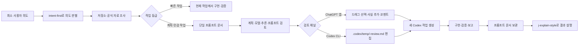

# j-token-workflow-kit

`j-token-workflow-kit`은 사용자가 최소한의 의도만 전달해도 Codex가 저장소와 필요한 외부 자료를 조사하고, 실행 계획과 새 작업용 프롬프트까지 준비하는 한국어 워크플로우 플러그인입니다.

현재 플러그인 버전: `1.2.1`

다이어그램은 실행 환경에 맞게 출력합니다. Codex Desktop에서는 Mermaid를 사용하고, Codex CLI에서는 Mermaid를 `text` 코드 블록 안의 ASCII 다이어그램으로 대체합니다.

## 1.2.1에서 달라진 점

- `j-explain-style`의 개념 설명을 익숙한 기준점에서 차이와 상태 변화를 따라가는 구조로 개편했습니다.
- 작업 결과 보고에는 강의식 구조를 강제하지 않고 결과, 변경, 검증과 남은 범위만 전달합니다.
- 개인 대화와 프로젝트 경험을 담은 원문 샘플을 제거하고 개인 서사를 재사용하지 않는 규칙을 추가했습니다.

## 1.2.0에서 달라진 점

1.2.0은 `사실관계 → 옵션 선택 → 계획서` 세 단계는 유지하면서 검토 수단을 ChatGPT 앱과 CLI의 Markdown 편집으로 단순화합니다.

- ChatGPT 앱에서는 응답의 사실·옵션·계획을 드래그해 선택하고, 선택한 문장을 기준으로 사실 추가·수정 또는 코멘트를 보낼 수 있습니다.
- Codex CLI에서는 `.codex/temp/<slug>-review.md`를 임시 검토 문서로 만들어 사용자가 직접 사실·옵션·계획과 코멘트를 편집하도록 권장합니다.
- 검토 결과는 기존 프롬프트 문서의 `[사용자 검토 결과]`와 실행 계획에 반영합니다.

- 빠른 작업: 문서를 만들지 않고 사용자의 현재 실행 요청에 따라 같은 작업에서 구현·검증합니다.
- 계획 작업: `.codex/prompts/active/<slug>.md` 한 파일에 사실, 조건, 결정, 계획, 검증, 모델, 추론 강도와 실행 프롬프트를 모읍니다. 스킬의 행동·라우팅·출력 계약을 바꾸는 수정은 변경량이 작아도 계획 작업으로 승격합니다.
- 민감 작업: 프롬프트 문서는 하나로 유지하고 삭제, 배포, 외부 전송, 권한 변경과 비가역 데이터 변경 직전에만 별도 승인을 받습니다.
- PRD, 기술 스펙과 독립 감사는 사용자가 명시적으로 요구하거나 외부 형식·고위험 계약에 실제로 필요할 때만 추가합니다.

## 작동 방식

모든 사용자 명령은 먼저 `intent-first`를 거칩니다. 이 단계에서 저장소를 보면 알 수 있는 지식 공백은 직접 조사하고, 실제 사용자 선택이 필요한 의도 공백만 질문합니다. 작업 결과나 새로운 지식을 사용자에게 설명할 때는 `j-explain-style`로 설명 순서를 구성합니다.



## Codex 실행 프롬프트 문서

```text
.codex/prompts/
├── README.md
├── active/<slug>.md
├── supporting/<slug>/<명시적으로-요청된-문서>.md
└── archive/YYYY/<slug>.md
```

`README.md`는 상태·유형·태그·갱신일로 찾는 카탈로그입니다. 한 작업의 권위 있는 실행 프롬프트는 `active/<slug>.md` 하나이며, 완료되면 내용을 복제하지 않고 상태를 갱신해 `archive/YYYY/`로 옮깁니다. `supporting/`은 사용자가 별도 PRD·기술 스펙을 요청한 경우에만 사용합니다. 최초 프롬프트 생성에서는 카탈로그와 프롬프트 문서로 실제 파일 2개가 생기고, 이후 작업마다 프롬프트 문서 1개를 추가하며 카탈로그를 갱신합니다.

프롬프트 문서에는 다음 정보가 함께 들어갑니다.

- 의도와 완료 상태
- 범위와 비범위
- 확인된 사실, 추정과 근거
- 조건, 결정과 기각한 대안
- 단계별 구현·검증 계획
- 권장 모델, 추론 강도와 선택 사유
- 새 Codex 작업에 그대로 전달할 완전한 프롬프트
- 결과와 후속

모델과 추론 강도는 사용자가 새 작업을 승인하기 전에 수정할 수 있습니다. 승인 후 Codex 앱의 새 작업 도구가 있으면 해당 설정으로 작업을 만들고, 없거나 실패하면 동일한 모델·추론 강도·프롬프트를 코드 블록으로 출력합니다.

## 검토 채널

검토 순서는 채널과 관계없이 다음 세 단계입니다.

1. **사실관계**: 확인된 사실·근거를 읽고, 틀린 사실을 수정하거나 새 사실과 근거를 추가합니다.
2. **옵션**: 질문별 선택과 선택 이유를 확인하고, 옵션이나 조건에 대한 의견을 남깁니다.
3. **계획서**: 실행 계획을 읽고, 선택한 문장을 코멘트하거나 전체 계획에 의견을 남깁니다.

### ChatGPT 앱

사실관계·옵션·계획서의 현재 내용은 각각 별도의 Markdown 코드 블록으로 보여줍니다. 사용자는 코드 블록 안의 문장을 드래그해 선택한 뒤 메시지로 수정·추가·코멘트를 보냅니다. 새 사실은 `내용`과 `근거`를 함께 적고, 코멘트는 선택한 문장과 바꿀 방향을 포함합니다. 코멘트가 있으면 가장 앞의 영향 단계(`사실관계`, `옵션`, `계획서`)부터 다시 제시합니다.

### Codex CLI

검토가 필요한 계획 작업에서는 `.codex/temp/<slug>-review.md`를 만들고, 현재 사실·옵션·계획과 다음 입력 칸을 넣습니다.

```md
## 사실관계 검토
### 추가·수정할 사실
- 내용:
- 근거:

## 옵션 검토
- Q1:
- 선택 또는 변경 의견:

## 계획서 검토
### 코멘트
- 인용:
- 의견:

## 검토 결과
- 시작 단계: facts | choices | plan
- 상태: feedback | approved
```

사용자가 이 임시 Markdown 파일을 편집하면 Codex가 파일을 다시 읽어 권위 문서 `.codex/prompts/active/<slug>.md`에 반영합니다. 임시 파일은 검토가 끝난 뒤 보관할 필요가 없으면 삭제합니다.

## 사용 예시

간단한 수정은 그대로 요청합니다.

```text
이 오타를 고치고 관련 테스트를 실행해줘.
```

조사와 별도 실행 작업이 필요한 목표는 프롬프트로 준비합니다.

```text
$setup-codex-prompt를 사용해 이 아이디어를 저장소와 공식 자료에서 조사하고 새 Codex 작업용 프롬프트를 만들어줘.
```

계획을 본 뒤 모델과 추론 강도를 바꿀 수 있습니다.

```text
모델은 gpt-5.6-sol, 추론 강도는 high로 바꾸고 이 계획으로 새 작업 시작해줘.
```

## 포함된 스킬

| 스킬 | 역할 |
| --- | --- |
| `intent-first` | 모든 사용자 명령에서 가장 먼저 의도를 판별하고, 조사·가정·질문 중 적절한 경로를 선택합니다. |
| `j-explain-style` | 개념은 익숙한 기준점에서 상태 변화를 따라 설명하고, 작업 결과는 결과·변경·검증·남은 범위로 간결하게 보고합니다. |
| `setup-codex-prompt` | 최소 의도에서 사실·조건·계획·모델·추론 강도·실행 프롬프트를 단일 프롬프트 문서로 만듭니다. |
| `requirements-to-spec` | 거친 요구사항을 조사해 Codex 실행 프롬프트로 수렴시키고, 명시적으로 필요한 경우에만 보조 문서를 연결합니다. |
| `start-implementation-thread` | 승인된 모델·추론 강도·실행 프롬프트로 새 Codex 작업을 만들고 실패 시 같은 내용을 출력합니다. |
| `bug-report-to-fix` | 간단한 버그는 바로 수정하되 스킬 변경이 필요하거나 복잡한 버그는 실행 프롬프트 준비 흐름으로 올립니다. |
| `figma-flow-to-implementation` | UI 흐름과 에셋을 조사하고 작업 등급에 따라 바로 구현하거나 프롬프트로 계획합니다. |
| `workflow-composer` | 요구사항, 버그와 UI 작업을 조합하되 산출물을 단일 Codex 실행 프롬프트로 수렴시킵니다. |
| `prd-writer` | 명시적으로 요청된 장기 제품 범위 문서를 작성합니다. |
| `technical-spec-writer` | 명시적으로 요청된 장기 공개 기술 계약을 작성합니다. |
| `audit-technical-spec` | 명시 요청 또는 고위험 계약에만 독립 감사를 적용합니다. |
| `orchestrate-subagents` | 독립 병렬화나 검토 이점이 있는 작업만 하위 에이전트에 배정합니다. |
| `prototype-design` | 확정 전 아이디어를 Mermaid나 프로토타입으로 보여줍니다. |
| `cognitive-writing` | 사용자 대상 문서의 인지 부하와 Markdown 오류를 줄입니다. |
| `branch-rule`, `commit-rule`, `git-push-safety`, `pr-rule` | Git 브랜치, 커밋, push와 PR의 안전 규칙을 제공합니다. |

## 문서 관리 근거

1.0.0은 MediaWiki의 카탈로그·랜딩 페이지, OCLC FAST의 낮은 비용 패싯 분류, Diátaxis의 독자 요구 분리, ADR의 작은 장기 결정 기록과 Plannotator `setup goal`의 검증 가능한 팩트 구조를 비교해 설계했습니다.

자세한 비교와 채택·기각 사유는 [Codex 프롬프트 문서 관리 조사](plugins/codex-workflow/references/prompt-document-management.md)에 있습니다.

## 저장소 구조

```text
.agents/plugins/marketplace.json
plugins/codex-workflow/.codex-plugin/plugin.json
plugins/codex-workflow/skills/
plugins/codex-workflow/references/
.codex/temp/<slug>-review.md
```

## 로컬 개발

```powershell
git diff --check
rg -n "사실관계|옵션|계획서|codex/temp" README.md plugins/codex-workflow workflow-plugin-design.md
```

별도 바이너리나 설치 스크립트 없이 플러그인 문서와 스킬 파일을 그대로 사용합니다.

## 라이선스

[Apache License 2.0](LICENSE)

Plannotator를 포함한 참고 프로젝트의 저작권과 라이선스는 [서드파티 고지](THIRD_PARTY_NOTICES.md)에서 확인할 수 있습니다.
