# j-token-workflow-kit

[한국어 README](README.ko.md)

TL;DR: `j-token-workflow-kit` is a Codex workflow plugin that turns rough requests into reviewable specs, code changes, and verification steps. It is designed for work that starts vague and needs to become concrete before implementation.

Current plugin version: `0.8.0`

## Why This Exists

Codex can implement quickly, but unclear requests can still produce unclear changes. This kit adds a lightweight workflow around the conversation:

- clarify the requirement through dialogue
- turn the clarified requirement into a PRD
- confirm the PRD, then write and review a technical spec
- implement from the approved technical spec
- verify the result after implementation

## Workflow

```mermaid
flowchart LR
    A["Work request"] --> B["Clarify requirements through conversation"]
    B --> C["Write and review the PRD"]
    C --> D["Confirm the PRD in a follow-up message"]
    D --> E["Write and review the technical spec"]
    E --> F["Approve the technical spec in a follow-up message"]
    F --> G["Select model and reasoning effort"]
    G --> H["Implement in a new thread"]
    H --> I["Verify after implementation"]
```



## How To Use

Start with a request that mentions the workflow you want to use:

```text
Use the workflow to organize this requirement.
```

Codex should first ask only the questions needed to reduce ambiguity. After the requirement is clear, ask it to write the PRD:

```text
Draft the agreed requirement as a PRD.
```

Review the PRD, then confirm that specific path or version in a separate message and request the technical spec. Review the technical spec in the same way before approving implementation.

When Codex presents the technical spec, that response ends the documentation turn. In a separate follow-up message, approve the specific technical spec and ask Codex to implement it:

```text
Approve .codex/temp/my-feature-technical-spec.md and start implementation.
```

Codex rereads the approved document, selects an appropriate GPT-5.6 Sol, Terra, or Luna model and reasoning effort, then creates a new thread in the same project for implementation. A request such as “document it, then implement it” is not approval; it still needs the separate follow-up message.

After implementation, the new task should verify the result and report what was checked.

## Included Skills

| Skill | Purpose |
|---|---|
| `requirements-to-spec` | Turns rough requirements into a PRD first, then a technical spec after separate confirmation. |
| `prd-writer` | Drafts technical PRDs for products, SDKs, CLIs, runtimes, and developer tools. |
| `technical-spec-writer` | Turns an approved PRD into an implementation contract with APIs, protocols, boundaries, and tests. |
| `bug-report-to-fix` | Captures bug details first, then moves into debugging and fixing after approval. |
| `figma-flow-to-implementation` | Converts Figma links, screenshots, or UI references into a screen flow and implementation spec. |
| `workflow-composer` | Combines multiple workflows when a request mixes requirements, bugs, and UI work. |
| `start-implementation-thread` | Selects a GPT-5.6 model and reasoning effort from the approved document, then starts implementation in a new task. |
| `orchestrate-subagents` | Gates subagent creation and assigns only necessary in-task work with role routing, minimal context, checkpoints, and file ownership. |
| `cognitive-writing` | Keeps documents easy to review by reducing cognitive load. |
| `branch-rule` | Defines branch naming rules. |
| `commit-rule` | Defines commit message rules. |
| `git-push-safety` | Prevents accidental pushes to the wrong branch. |
| `pr-rule` | Defines pull request writing rules. |

## Recommended Prompts

```text
Use the workflow to clarify this requirement before implementation.
```

```text
Draft the agreed requirement as a PRD.
```

```text
Draft this product idea as a PRD.
```

```text
Approve .codex/temp/my-feature-prd.md and write the technical spec.
```

```text
Review this spec and leave comments for anything unclear.
```

```text
Apply the review comments.
```

```text
Approve .codex/temp/my-feature-technical-spec.md and start implementation.
```

```text
Verify the implementation and summarize the result.
```

## Repository Layout

```text
.agents/plugins/marketplace.json
plugins/codex-workflow/.codex-plugin/plugin.json
plugins/codex-workflow/skills/
plugins/codex-workflow/references/
```

## License

[Apache License 2.0](LICENSE)
