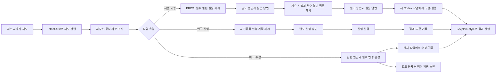

# j-token-workflow-kit

`j-token-workflow-kit`은 Codex가 저장소와 필요한 외부 자료를 먼저 조사한 뒤, 작업 성격에 맞는 승인 경계와 구현 경로를 선택하는 한국어 워크플로우 플러그인입니다. 플러그인 패키지는 Agent Plugins 1.0.0의 이식 가능한 표준 구조를 따릅니다.

버전 1.5.0부터 열린 질문이 없는 이진 승인에는 Python MCP 서버가 제공하는 인라인 `승인`·`취소` 카드를 사용할 수 있습니다. 호스트가 MCP Apps UI를 렌더링하지 않으면 같은 도구 결과가 한국어 텍스트 승인 질문으로 폴백합니다.

현재 플러그인 버전: `1.6.0`

다이어그램은 실행 환경에 맞게 출력합니다. Codex Desktop에서는 Mermaid를 사용하고, Codex CLI에서는 Mermaid를 `text` 코드 블록 안의 ASCII 다이어그램으로 대체합니다.

## 1.6.0에서 달라진 점

- 플러그인 루트의 `plugin.json`, `mcp.json`, `skills/` 고정 위치를 사용하는 Agent Plugins 1.0.0 표준으로 전체 마이그레이션했습니다.
- 레거시 Codex 전용 `.codex-plugin/plugin.json`과 `.mcp.json`을 제거했습니다.
- 매니페스트에서 구성 요소 경로를 직접 선언하지 않고 표준 클라이언트가 고정 위치에서 스킬과 MCP 서버를 발견하도록 변경했습니다.
- 모든 `SKILL.md`의 Agent Skills 핵심 계약과 두 표준 JSON 문서의 회귀 검증을 추가했습니다.

## 호환성

1.6.0은 Agent Plugins 표준 전용 패키지입니다. `.codex-plugin/plugin.json`과 `.mcp.json`만 인식하는 레거시 Codex 플러그인 로더와는 호환되지 않습니다. `.agents/plugins/marketplace.json`은 저장소 배포 카탈로그로 유지하지만, 실제 설치 호스트가 Agent Plugins 1.0.0의 루트 매니페스트를 지원해야 합니다.

## 1.5.1에서 달라진 점

- 번들 MCP 서버 설정의 래퍼를 Codex가 지원하는 `mcp_servers`로 수정해 `show_workflow_confirmation`과 `submit_workflow_decision`이 도구 목록에 등록되도록 했습니다.
- 잘못된 `mcpServers` 래퍼가 다시 들어오지 않도록 MCP 설정 회귀 테스트를 추가했습니다.

## 1.5.0에서 달라진 점

- Python 표준 라이브러리만 사용하는 로컬 MCP 서버와 `text/html;profile=mcp-app` 승인 카드를 추가했습니다.
- 열린 질문이 없는 이진 승인에는 `승인`·`취소` 버튼을 사용하고, 여러 선택이 필요한 질문은 기존 대화 흐름을 유지합니다.
- 버튼이 보내는 후속 메시지는 카드에 표시된 제목과 설명에서 서버가 생성하며, 숨은 별도 프롬프트를 받지 않습니다.
- Codex 호스트의 MCP Apps UI 렌더링 여부는 후속 통합 테스트 범위로 남기고, 미지원 호스트에서는 텍스트로 폴백합니다.
- 모든 구현·수정 요청은 최초 요청과 실행 승인을 분리하고, 변경 범위·동작·검증·제외 범위를 제시한 뒤 별도 승인 메시지를 받아 구현합니다.

## 1.4.0에서 달라진 점

- PRD에서 기술 스펙으로, 기술 스펙에서 구현으로 넘어가기 전에 다음 단계를 막는 열린 질문을 문서 링크와 함께 대화에 반드시 제시합니다.
- 사용자가 문서를 먼저 승인했더라도 미제시·미응답 질문이 있으면 승인은 보존하고 질문부터 처리합니다.
- `승인`은 권장안 선택으로 간주하지 않습니다. 질문 제시 후 `권장안대로 승인`하거나 질문별로 직접 답할 수 있습니다.

## 1.3.0에서 달라진 점

- 제품 PRD 흐름과 분리된 `research-experiment-workflow`를 추가했습니다.
- 연구 가설은 `근거 조사 → 사전등록 실험 계획 제시 → 별도 실행 승인 → 결과·교훈 기록` 순서로 진행합니다.
- 실험 계획은 비교군, 통제 변수, 계보, 표본·seed, 성공·실패·차단 기준과 산출물을 실행 전에 고정합니다.

## 1.2.1에서 달라진 점

- `j-explain-style`의 개념 설명을 익숙한 기준점에서 차이와 상태 변화를 따라가는 구조로 개편했습니다.
- 작업 결과 보고에는 강의식 구조를 강제하지 않고 결과, 변경, 검증과 남은 범위만 전달합니다.
- 개인 대화와 프로젝트 경험을 담은 원문 샘플을 제거하고 개인 서사를 재사용하지 않는 규칙을 추가했습니다.

## 현재 실행 원칙

- 제품·기능 요청은 0.9.0 방식으로 `요구사항 조사 → PRD와 필수 열린 질문 제시 → 승인·답변 → 기술 스펙과 필수 열린 질문 제시 → 승인·답변 → 새 Codex 작업` 순서로 진행합니다.
- 연구·실험 요청은 PRD와 기술 스펙을 만들지 않고 `근거 조사 → 사전등록 계획 제시 → 별도 실행 승인 → 결과·교훈 기록` 순서로 진행합니다.
- 버그 수정 요청은 원인을 먼저 조사한 뒤, 요청 증상과 직접 관련된 원인 및 필수 변경 범위를 제시해 별도 승인받고 수정·검증합니다.
- 조사 중 발견한 별도 버그, 독립 리팩터링과 요청하지 않은 기능은 자동으로 수정하지 않고 범위 확장 승인을 받습니다.
- UI 구현은 화면 흐름과 에셋을 조사해 단일 UI 스펙/구현 문서를 제시하고, 별도 승인 후 새 Codex 작업으로 인계합니다.
- 삭제, 배포, 외부 전송, 권한 변경과 비가역 데이터 변경은 해당 위험 행동 직전에만 확인합니다.
- 버튼형 카드는 문서·계획·범위 전환을 확인하며, Codex의 네이티브 보안 승인을 대체하지 않습니다.
- `이 방식으로 하죠`뿐 아니라 `구현해줘`, `고쳐줘`, `바로 진행해줘` 같은 최초 요청도 실행 승인으로 확대하지 않습니다. 모든 구현·수정은 별도 승인 카드를 거칩니다.
- 브랜치 이름은 저장소 고유 규칙이 없으면 `feat/`, `bug/`, `perf/`, `refactor/`, `misc/`만 사용하며 `codex/`를 자동으로 앞에 붙이지 않습니다.

## 1.2.0에서 달라진 점

1.2.0은 `사실관계 → 옵션 선택 → 계획서` 세 단계는 유지하면서 검토 수단을 ChatGPT 앱과 CLI의 Markdown 편집으로 단순화합니다.

- ChatGPT 앱에서는 응답의 사실·옵션·계획을 드래그해 선택하고, 선택한 문장을 기준으로 사실 추가·수정 또는 코멘트를 보낼 수 있습니다.
- Codex CLI에서는 `.codex/temp/<slug>-review.md`를 임시 검토 문서로 만들어 사용자가 직접 사실·옵션·계획과 코멘트를 편집하도록 권장합니다.
- 검토 결과는 기존 프롬프트 문서의 `[사용자 검토 결과]`와 실행 계획에 반영합니다.

- 실행 작업: 1.2.0 당시에는 수정·구현 요청을 조사 뒤 같은 작업에서 실행했습니다. 1.5.0부터는 현재 실행 원칙에 따라 변경 범위를 별도 승인받은 뒤 구현·검증합니다.
- 계획 작업: 사용자가 조사·계획·스펙·프롬프트만 요청했을 때 `.codex/prompts/active/<slug>.md` 한 파일에 사실, 조건, 결정, 계획, 검증, 모델, 추론 강도와 실행 프롬프트를 모읍니다.
- 민감 작업: 프롬프트 문서는 하나로 유지하고 삭제, 배포, 외부 전송, 권한 변경과 비가역 데이터 변경 직전에만 별도 승인을 받습니다.
- PRD, 기술 스펙과 독립 감사는 사용자가 명시적으로 요구하거나 외부 형식·고위험 계약에 실제로 필요할 때만 추가합니다.

## 작동 방식

모든 사용자 명령은 먼저 `intent-first`를 거칩니다. 이 단계에서 저장소를 보면 알 수 있는 지식 공백은 직접 조사하고, 실제 사용자 선택이 필요한 의도 공백만 질문합니다. 작업 결과나 새로운 지식을 사용자에게 설명할 때는 `j-explain-style`로 설명 순서를 구성합니다.



## 0.9.0 방식의 단계 문서

제품·기능 작업은 `.codex/temp/` 아래에서 책임이 다른 문서를 유지합니다.

```text
.codex/temp/
├── YYYYMMDD-HHMM-feat-<topic>-workflow.md
├── <product>-prd.md
└── <product>-technical-spec.md
```

- 작업 문서는 조사 결과, 열린 질문, 결정과 제외 방향을 누적합니다.
- PRD는 제품 목적, 범위, 기능 요구사항과 수용 기준을 확정합니다.
- 기술 스펙은 승인된 PRD를 타입, 상태, API, 경계와 검증 계약으로 구체화합니다.
- 각 문서를 제시한 응답은 그 단계에서 끝냅니다. 최초 요청의 `문서 작성 후 구현`은 다음 단계 승인으로 간주하지 않습니다.
- 다음 단계를 막는 열린 질문은 문서 안에만 두지 않고 문서 링크와 함께 대화에도 제시합니다. `승인`은 권장안 선택이 아니며, 질문 제시 후 `권장안대로 승인` 또는 질문별 직접 답변을 받습니다.
- 문서 동일성은 경로와 버전, Git 변경 상태와 필요한 의미 검증으로 확인합니다. 외부 시스템이 전체 해시를 계약으로 요구할 때만 SHA-256을 사용합니다.

## 사용 예시

간단한 수정은 그대로 요청합니다.

```text
이 오타를 고치고 관련 테스트를 실행해줘.
```

제품·기능 목표는 PRD부터 준비합니다.

```text
$requirements-to-spec을 사용해 이 아이디어를 조사하고 PRD부터 작성해줘.
```

문서와 함께 제시된 열린 질문은 한꺼번에 권장안으로 승인하거나 항목별로 답할 수 있습니다.

```text
권장안대로 승인
```

```text
Q1: 선택지 B
Q2: 직접 입력한 결정
```

열린 질문이 모두 해결되어 승인·취소만 남으면 플러그인이 인라인 승인 카드를 요청합니다. 카드가 표시되지 않는 호스트에서는 같은 내용을 채팅으로 답합니다.

연구 가설은 별도 실험 계획으로 준비합니다.

```text
$research-experiment-workflow를 사용해 이 가설을 조사하고 실행 전 실험 계획을 작성해줘.
```

기술 스펙을 승인할 때 모델과 추론 강도를 지정할 수 있습니다.

```text
이 기술 스펙대로 구현을 승인합니다. 모델은 gpt-5.6-sol, 추론 강도는 high로 새 작업을 시작해줘.
```

## 포함된 스킬

| 스킬 | 역할 |
| --- | --- |
| `intent-first` | 모든 사용자 명령에서 가장 먼저 의도를 판별하고, 조사·가정·질문 중 적절한 경로를 선택합니다. |
| `j-explain-style` | 개념은 익숙한 기준점에서 상태 변화를 따라 설명하고, 작업 결과는 결과·변경·검증·남은 범위로 간결하게 보고합니다. |
| `requirements-to-spec` | 거친 요구사항을 조사해 PRD와 필수 열린 질문을 먼저 제시하고, 승인·답변 후 기술 스펙으로 구체화합니다. |
| `research-experiment-workflow` | 연구 가설을 조사해 사전등록 실험 계획으로 만들고, 별도 승인 후 실행과 결과·교훈 기록으로 연결합니다. |
| `start-implementation-thread` | 별도 메시지로 승인된 기술 스펙 또는 UI 구현 문서를 다시 읽고 새 Codex 작업을 시작합니다. |
| `bug-report-to-fix` | 버그 원인을 먼저 조사하고 요청 증상과 직접 관련된 변경 범위를 승인받은 뒤 수정·검증하며, 별도 문제는 범위 확장 승인을 받습니다. |
| `figma-flow-to-implementation` | UI 흐름과 에셋을 조사해 단일 UI 구현 문서를 제시하고 승인 후 구현 작업으로 인계합니다. |
| `workflow-composer` | 제품·기능, 연구·실험, 버그와 UI 작업을 각기 다른 승인 경계로 조합합니다. |
| `prd-writer` | 제품 목적, 범위, 기능 요구사항과 수용 기준을 작성하고 기술 스펙 전 열린 질문을 대화에서 확인합니다. |
| `technical-spec-writer` | 승인된 PRD를 구현 계약으로 구체화하고 구현 전 열린 질문을 대화에서 확인합니다. |
| `audit-technical-spec` | 명시 요청 또는 고위험 계약에만 독립 감사를 적용합니다. |
| `orchestrate-subagents` | 독립 병렬화나 검토 이점이 있는 작업만 하위 에이전트에 배정합니다. |
| `prototype-design` | 확정 전 아이디어를 Mermaid나 프로토타입으로 보여줍니다. |
| `cognitive-writing` | 사용자 대상 문서의 인지 부하와 Markdown 오류를 줄입니다. |
| `branch-rule`, `commit-rule`, `git-push-safety`, `pr-rule` | Git 브랜치, 커밋, push와 PR의 안전 규칙을 제공합니다. |

## 문서 관리 근거

1.0.0은 MediaWiki의 카탈로그·랜딩 페이지, OCLC FAST의 낮은 비용 패싯 분류, Diátaxis의 독자 요구 분리, ADR의 작은 장기 결정 기록과 Plannotator `setup goal`의 검증 가능한 팩트 구조를 비교해 설계했습니다.

자세한 비교와 채택·기각 사유는 [Codex 프롬프트 문서 관리 조사](plugins/codex-workflow/references/prompt-document-management.md)에 있습니다.

## 저장소 구조

```text
.agents/plugins/marketplace.json
plugins/codex-workflow/plugin.json
plugins/codex-workflow/mcp.json
plugins/codex-workflow/mcp/server.py
plugins/codex-workflow/mcp/approval.html
plugins/codex-workflow/skills/
plugins/codex-workflow/references/
.codex/temp/<slug>-review.md
```

## 로컬 개발

```powershell
git diff --check
$env:PYTHONUTF8='1'
python -m unittest plugins/codex-workflow/mcp/test_server.py
go test ./...
```

승인 MCP 서버는 Python 표준 라이브러리만 사용하므로 별도 패키지 설치가 필요하지 않습니다.

## 라이선스

[Apache License 2.0](LICENSE)

Plannotator를 포함한 참고 프로젝트의 저작권과 라이선스는 [서드파티 고지](THIRD_PARTY_NOTICES.md)에서 확인할 수 있습니다.
