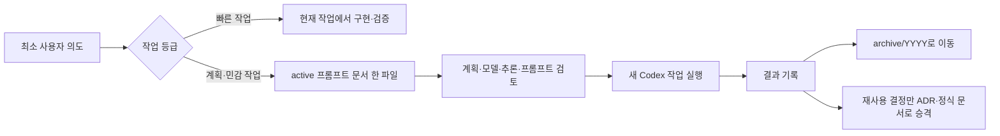

# Codex 프롬프트 문서 관리 조사와 1.0.0 설계 근거

## 조사 배경

기존 워크플로우는 하나의 작업에서 PRD, 기술 스펙, 감사 보고서와 임시 작업 문서를 만들었다. 문서마다 별도 승인을 요구해 간단한 수정도 여러 턴을 거쳤고, 같은 요구사항의 최신 상태가 여러 파일로 갈라졌다.

핵심 판단 축은 `한 작업의 실행 진실이 몇 군데에 흩어지는가`다.

## 확인한 레퍼런스

### Plannotator setup goal

Plannotator의 goal 준비 흐름은 인터뷰 결과, 팩트 검토, 팩트 목록·메타데이터, 계획과 goal 문서를 나눠 보존한다. 팩트를 검증 가능한 문장으로 만들고 계획에 연결하는 방식은 유용하다. 그러나 goal당 여러 JSON·Markdown 파일과 고정 계획 승인 게이트가 생기므로 문서 수와 승인 횟수를 줄이려는 이번 목표에는 그대로 적용하지 않는다.

- 저장소: https://github.com/backnotprop/plannotator
- 비교에 사용한 로컬 스킬: `plannotator-setup-goal`

### Plannotator의 배포 방식 검토

Plannotator의 macOS·Linux·Windows 실행 파일과 설치·릴리스 파이프라인은 참고할 수 있었지만, `codex-workflow`에 같은 구조를 유지하면 OS별 빌드, checksum, 설치 스크립트와 smoke test를 계속 관리해야 한다. 현재는 이 배포 방식을 채택하지 않고 ChatGPT 앱의 드래그 선택과 Codex CLI의 임시 Markdown 편집으로 검토를 수행한다.

- https://github.com/backnotprop/plannotator/releases
- https://github.com/backnotprop/plannotator

### MediaWiki의 카테고리와 랜딩 페이지

MediaWiki는 카테고리를 관련 페이지의 자동 인덱스이자 목차로 사용하고, 랜딩 페이지는 필수 링크를 독자·작업 기준으로 묶는 진입점으로 설명한다. 이를 `.codex/prompts/README.md` 카탈로그와 `active/archive` 상태 분류에 적용한다.

- https://www.mediawiki.org/wiki/Help:Categories
- https://www.mediawiki.org/wiki/Documentation/Landing_pages

### OCLC FAST의 패싯 분류

OCLC의 FAST는 복잡한 주제명 표목을 비전문가도 낮은 비용으로 적용할 수 있는 패싯 구조로 단순화한다. 이를 깊은 폴더 계층 대신 `상태`, `유형`, `위험`, `태그`, `갱신일`처럼 서로 독립적인 최소 메타데이터에 적용한다.

- https://www.oclc.org/research/areas/data-science/fast.html

### Diátaxis의 독자 요구 분리

Diátaxis는 문서를 튜토리얼, 방법 안내, 레퍼런스, 설명의 서로 다른 독자 요구로 나눈다. 실행 중인 프롬프트 문서는 이 네 유형을 모두 축적하는 백과사전이 아니라 `현재 작업을 끝내기 위한 실행 계약`으로 제한한다. 재사용 가치가 생긴 내용만 완료 후 적절한 정식 문서로 승격한다.

- https://diataxis.fr/
- https://diataxis.fr/start-here/

### ADR의 작은 결정 기록

Michael Nygard는 큰 문서가 갱신되지 않는 문제를 지적하고, 아키텍처적으로 중요한 결정만 짧은 ADR로 남기며 대체된 결정을 삭제하지 않고 상태와 후속 링크를 보존하는 방식을 제안한다. 이를 모든 프롬프트 문서를 ADR로 쪼개는 데 쓰지 않고, 여러 작업에서 장기 재사용할 중요한 결정만 별도 승격하는 기준으로 사용한다.

- https://cognitect.com/blog/2011/11/15/documenting-architecture-decisions

## 기각안과 채택안

- 기각: PRD와 기술 스펙을 계속 분리하고 폴더만 정리한다. 같은 범위·수용 기준·결정의 최신 상태를 여러 파일에서 맞춰야 하므로 핵심 문제를 남긴다.
- 기각: Plannotator의 인터뷰·팩트·계획 JSON을 그대로 복제한다. 출처 추적은 좋아지지만 goal당 파일 수가 늘어난다.
- 기각: OS별 검토 바이너리와 로컬 브라우저 UI를 계속 배포한다. 검토 순서는 유지되지만 빌드·설치·자산 관리가 실행 계약보다 커진다.
- 채택: 빠른 작업은 문서 없이 실행하고, 계획 작업은 `카탈로그 1개 + 작업당 권위 프롬프트 문서 1개`로 관리한다. 사실과 근거, 조건, 결정, 계획, 모델, 추론 강도와 최종 프롬프트를 한 파일에서 갱신한다.

## 수명 주기

## 1.0.0 규칙

1. 작업마다 PRD·기술 스펙을 강제하지 않는다.
2. 사용자 실행 요청은 빠른 작업의 실행 권한으로 인정한다.
3. 새 작업을 만들 때만 계획·모델·추론 강도·프롬프트를 한 번 검토한다.
4. 비가역·외부 영향 행동은 그 행동 직전에 별도 승인을 받는다.
5. 독립 감사와 하위 에이전트 검토는 위험·복잡도에 따라 선택하고, 도구 부재만으로 저위험 작업을 차단하지 않는다.
6. 기존 PRD·기술 스펙 스킬은 사용자가 명시적으로 문서를 원하거나 외부 형식이 필요할 때 사용하는 선택 도구로 남긴다.
