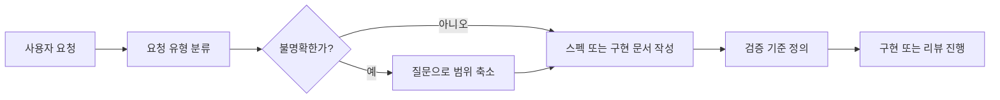
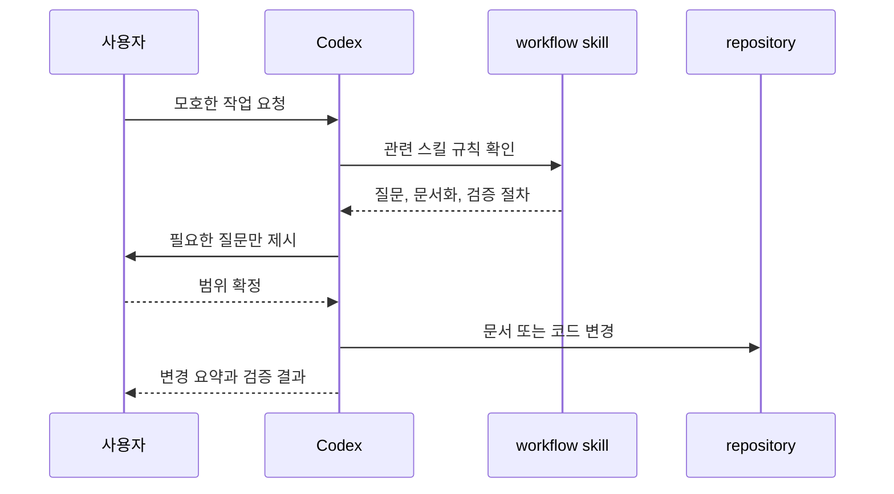
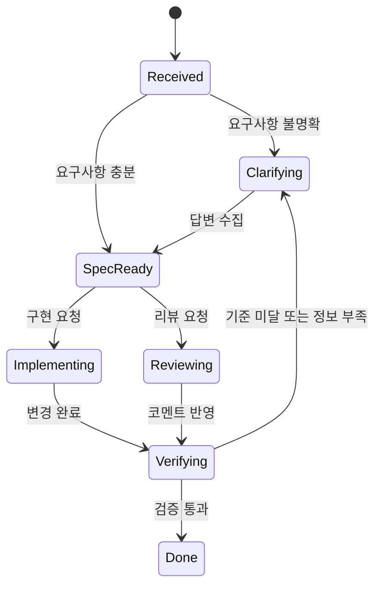
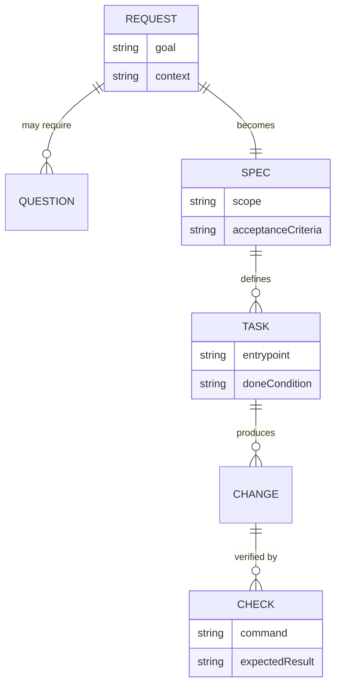

# Codex Desktop Mermaid 예시 문서

## 요약

- Codex Desktop에서 복잡한 변경을 설명할 때는 텍스트보다 Mermaid 다이어그램을 먼저 배치한다.
- 하나의 거대한 다이어그램 대신 흐름, 상호작용, 상태, 데이터 관계를 작은 다이어그램으로 나눈다.
- 본문은 다이어그램을 다시 설명하지 않고, 결정 이유와 검증 기준만 보강한다.

## 배경/맥락

Codex Desktop은 Mermaid를 바로 렌더링할 수 있으므로, 독자가 긴 설명을 머릿속에서 재조립하지 않아도 된다. 특히 워크플로우 스킬처럼 "요청 해석 → 문서화 → 구현 → 검증"이 이어지는 작업은 주체와 상태가 많아 텍스트만으로 읽으면 외재적 부하가 커진다.

이 문서는 `cognitive-writing` 스킬의 Codex Desktop Mermaid 규칙을 적용한 예시다.

## 전체 흐름

## 상호작용 순서

## 상태 전이

## 데이터 관계

## 판단 기준

- **목적**: 독자가 워크플로우 전체를 한 번에 기억하지 않아도 되게 한다.
- **진입점**: 먼저 "전체 흐름"을 보고, 필요한 경우 "상호작용 순서"와 "상태 전이"를 확인한다.
- **핵심 결정**: 하나의 다이어그램에 모든 정보를 넣지 않고 관점별로 분리한다.
- **검증/통과 기준**: 독자가 텍스트 본문을 읽기 전에 요청 처리 흐름, 참여 주체, 상태 변화, 데이터 관계를 각각 설명할 수 있으면 통과다.

## 트레이드오프

- 대안 A: 하나의 큰 `flowchart`에 모든 정보를 표현한다. 노드와 엣지가 많아져 처음 읽는 사람이 핵심 경로를 놓치기 쉽다.
- 대안 B: 텍스트 설명만 사용한다. 작성은 빠르지만 독자가 순서와 상태를 직접 조립해야 한다.
- 채택안: 작은 Mermaid 다이어그램 여러 개를 사용한다. 문서 길이는 조금 늘지만 작업기억에 올려야 하는 단위가 작아진다.

## 검증 기준

- Mermaid 블록마다 언어 태그가 `mermaid`로 지정되어 있다.
- 각 다이어그램은 하나의 관점만 설명한다.
- 본문은 다이어그램과 중복되는 나열을 줄이고, 왜 그렇게 나눴는지 설명한다.
- 전체 섹션 수는 한 화면에서 구조를 잡을 수 있는 수준으로 유지한다.
