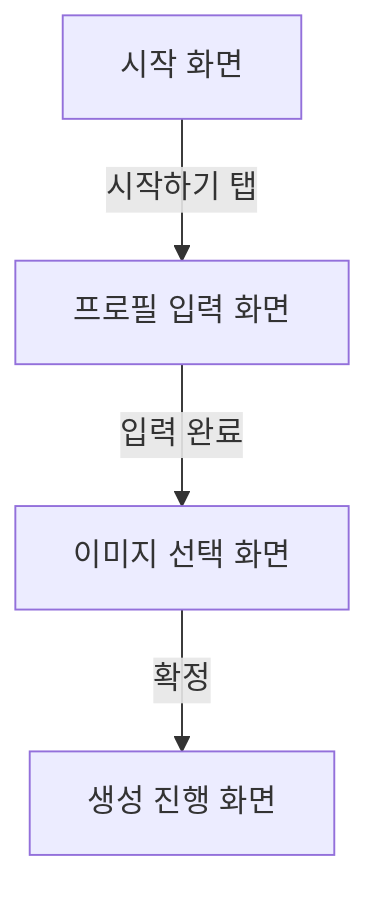

# Figma 흐름에서 구현까지

## 출력 언어

이 스킬이 만드는 모든 사용자 대상 출력, 문서, 프롬프트, 보고서, 계획, 스펙 및 기타 산출물은 한국어로 작성합니다. 제목, 섹션, 레이블, 표, 체크리스트, 다이어그램, 템플릿도 한국어로 작성합니다. 코드, 명령어, 파일 경로, 식별자, API 이름, 모델 ID, 프로토콜 이름과 필수 고유명사는 번역하지 않습니다.

## 작성 문서 첨부

요청된 모든 문서의 작성 또는 갱신을 마친 뒤 최종 응답에 각 문서를 `[문서 이름](절대 경로)` 형식의 Markdown 링크로 반드시 첨부합니다. 링크에는 독립된 디렉터리 세그먼트로 구성된 절대 경로를 사용하고, 디렉터리 구분자를 생략하거나 경로 세그먼트를 붙여 쓰지 않습니다. Windows 경로를 문자열로 표시할 때는 `C:\\Users\\WinUser\\Documents\\폴더\\문서.md`처럼 각 역슬래시를 두 번 씁니다.

## 임시 문서 경로 표시 규칙

사용자에게 임시 문서 경로를 안내할 때 Windows 표기는 반드시 `\\.codex\\temp\\...`처럼 각 역슬래시를 두 번 써서 표현합니다. `\.codex\temp`처럼 쓰면 `\.`가 하나의 문자로 처리되어 앞의 역슬래시가 사라질 수 있으므로 사용하지 않습니다. 코드 블록에서 저장소 상대 경로 자체를 보여줄 때는 `.codex/temp/...` 형식을 사용할 수 있습니다.

## 진행 흐름

1. 제공된 모든 시각 자료를 읽습니다.
2. 링크 순서를 화면 전이 순서로 간주하지 않습니다.
3. 화면 이름은 원시 Figma ID가 아니라 사용자가 이해할 수 있는 의미 기반 이름으로 붙입니다.
4. 구현에 필요한 화면 프레임 이미지, 아이콘, 로고, 일러스트, 기타 미디어 에셋을 식별합니다.
5. Figma 접근이 가능하면 브라우저에서 Figma OAuth 승인을 거친 뒤 CLI로 REST API에서 필요한 노드 JSON, 화면 이미지, 에셋을 직접 내려받습니다.
6. 추정한 전이를 Mermaid 흐름도로 작성합니다.
7. 사용자에게 화면 순서, 누락 요소, 전이 조건을 수정받습니다.
8. `.codex/temp` 아래 임시 UI 작업 문서를 갱신합니다.
9. 사용자가 요청하거나 확정한 뒤에만 최종 단일 UI 스펙/구현 문서를 작성합니다.
10. 문서를 제시한 뒤 현재 턴을 끝냅니다. 이후 별도 사용자 메시지에서 문서 경로 또는 버전을 확인하며 명시적으로 구현을 승인하면 `start-implementation-thread`를 적용해 별도의 Codex 작업에서 구현합니다.

## 입력 선택지

Figma가 가장 흔하고 가능하면 우선 사용하지만 필수는 아닙니다.

허용 입력:

- Figma 플러그인 컨텍스트
- Figma 링크
- 스크린샷
- 화면 녹화
- 사용자가 작성한 화면 설명

가장 강한 입력을 사용합니다. Figma 플러그인 접근이 가능하면 우선 사용하고, 불가능하면 링크, 스크린샷, 설명으로 진행합니다. Figma 링크에 접근할 수 있고 구현에 시각 에셋이 필요하면 REST API 기반 CLI 에셋 수집 경로를 기본으로 채택합니다.

## 임시 문서

레포 루트 기준 `.codex/temp/` 디렉터리에 작성하고, 없으면 생성합니다. 모든 문서는 `cognitive-writing` 스킬의 원칙을 따라 작성합니다.

파일명은 다음 형식을 사용합니다.

```text
.codex/temp/YYYYMMDD-HHMM-feat-<topic>-ui-workflow.md
```

## 임시 문서 템플릿

```md
# UI 작업 문서

## 화면 목록

## 추정 화면 흐름

## Mermaid 흐름도

## 화면별 핵심 요소

## 필요한 Figma 에셋

## Figma REST API 수집 계획

## 사용자 확인 필요

## 확정된 전이 규칙

## 제외된 전이

## 요약

## 구현 범위

## 화면별 구현 요구사항

## 상태/에러/로딩 처리

## 기존 코드 연결 지점

## 검증 기준
```

## Mermaid 규칙

의미가 드러나는 라벨을 사용합니다.



사용자가 명시적으로 필요하다고 하지 않는 한 원시 Figma 노드 ID를 차트에 넣지 않습니다.

## Figma REST API 에셋 수집 규칙

- Figma 링크에서 `file_key`와 `node-id`를 파싱합니다.
- 브라우저에서 Figma OAuth 승인 URL을 열어 사용자가 로그인과 권한 승인을 직접 수행하게 합니다. OAuth 승인, 계정 연결, 권한 허용은 외부 계정 권한을 부여하는 행동이므로 실행 전에 대상 Figma 계정, 요청 scope, redirect URL을 사용자에게 확인합니다.
- OAuth 앱은 최소 권한을 사용합니다. 파일 구조, 노드, 화면 이미지 export에는 `file_content:read` scope를 기본으로 사용하고, 사용자 식별이 필요한 경우에만 `current_user:read`을 추가합니다.
- OAuth callback의 `state`를 검증하고, 가능하면 PKCE를 사용합니다. 인증 코드는 짧게 만료되므로 callback을 받은 즉시 CLI 또는 로컬 helper가 token endpoint에서 access token으로 교환합니다.
- CLI 요청은 `Authorization: Bearer <TOKEN>` 헤더를 사용합니다. 토큰, refresh token, client secret은 로그, 문서, 커밋, PR 본문에 남기지 않습니다.
- CLI는 먼저 `GET /v1/files/:key` 또는 `GET /v1/files/:key/nodes?ids=...`로 화면 구조와 export 대상 노드를 확인합니다.
- 화면 단위 이미지는 `GET /v1/images/:key?ids=...&format=png&scale=...`로 export URL을 받아 내려받습니다. SVG가 필요한 아이콘/벡터는 `format=svg`를 우선 검토합니다.
- Figma image fill 원본은 `GET /v1/files/:key/images`로 다운로드 URL을 확인한 뒤 내려받습니다.
- 내려받은 파일은 구현 레포의 기존 asset 관례에 맞춰 저장하고, 임시 문서와 최종 문서에 node id, 파일명, 저장 위치, export 옵션, 확보 여부를 매핑합니다.
- API 권한, 링크 권한, 렌더링 실패, null 이미지 URL 때문에 수집할 수 없는 에셋은 직접 재구현하지 말고 사용자에게 확인합니다.

## 구현 규칙

- 문서를 제시한 응답에서는 구현하지 않고 현재 턴을 끝냅니다. 최초 요청의 `정리 후 구현해줘` 같은 문구는 승인으로 인정하지 않습니다.
- 이후 별도 사용자 메시지에서 문서 경로 또는 버전을 확인하며 `승인` 또는 `이 문서대로 구현 시작`이라고 한 경우에만 현재 작업에서 직접 코드를 수정하지 말고 `start-implementation-thread`에 UI 스펙/구현 문서 경로를 전달합니다.
- 수정 전 기존 라우팅, 컴포넌트 구조, 디자인 시스템을 확인합니다.
- Figma 원본에 화면 프레임, 이미지, 아이콘, 로고, 일러스트, 제품 화면, 사진, 텍스처 같은 시각 에셋이 있으면 직접 재구현하기 전에 먼저 REST API 기반 CLI로 원본 에셋을 내려받거나 내보내서 사용합니다.
- 에셋을 받을 수 없으면 어떤 에셋이 필요한지, 왜 받을 수 없는지, 임시 대체 구현을 써도 되는지 사용자에게 확인합니다.
- 단순 도형, 레이아웃, 텍스트 스타일처럼 코드로 충실히 재현 가능한 요소만 직접 구현합니다.
- 임시 문서와 최종 문서에 필요한 에셋 목록, 확보 여부, 저장 위치 또는 대체 방식을 남깁니다.
- 현재 앱의 패턴을 유지합니다.
- 사용자가 자연스럽게 기대하는 상태를 포함합니다: 로딩, 빈 상태, 에러, 비활성, 성공 상태.
- 프론트엔드 변경은 로컬 브라우저 대상이 있으면 시각적으로 검증합니다.
