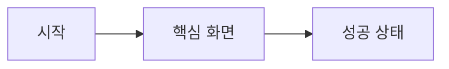

# 프로토타입 설계

## 출력 언어

이 스킬이 만드는 모든 사용자 대상 출력, 프로토타입 문서, 프롬프트, 보고서와 화면 문구는 한국어로 작성합니다. 제목, 섹션, 레이블, 표, 체크리스트, 다이어그램, 템플릿과 Mermaid 레이블도 한국어로 작성합니다. 코드, 명령어, 파일 경로, 식별자, API 이름과 필수 고유명사는 번역하지 않습니다.

## 작성 문서 첨부

요청된 모든 문서의 작성 또는 갱신을 마친 뒤 최종 응답에 각 문서를 `[문서 이름](절대 경로)` 형식의 Markdown 링크로 반드시 첨부합니다. 링크에는 독립된 디렉터리 세그먼트로 구성된 절대 경로를 사용하고, 디렉터리 구분자를 생략하거나 경로 세그먼트를 붙여 쓰지 않습니다. Windows 경로를 문자열로 표시할 때는 `C:\\Users\\WinUser\\Documents\\폴더\\문서.md`처럼 각 역슬래시를 두 번 씁니다.

## 임시 문서 경로 표시 규칙

사용자에게 임시 문서 경로를 안내할 때 Windows 표기는 반드시 `\\.codex\\temp\\...`처럼 각 역슬래시를 두 번 써서 표현합니다. `\.codex\temp`처럼 쓰면 `\.`가 하나의 문자로 처리되어 앞의 역슬래시가 사라질 수 있으므로 사용하지 않습니다. 코드 블록에서 저장소 상대 경로 자체를 보여줄 때는 `.codex/temp/...` 형식을 사용할 수 있습니다.

## 목적

제품 아이디어, 화면 흐름 또는 시각적 방향이 확정되기 전에 사용자가 직접 보고 클릭할 수 있는 프로토타입을 만듭니다. 산출물은 피드백을 받기 위한 검토 가능한 콘셉트이며, 프로덕션 구현, Figma 파일 또는 최종 디자인 스펙이 아닙니다.

## 작업 공간 구조

프로토타입을 시작하기 전에 다음 디렉터리를 만듭니다.

```text
.codex/temp/prototype/YYYYMMDD-<짧은-프로토타입-이름>/
├── prototype.md
├── screenshots/
└── src/
    ├── index.html
    ├── styles.css
    └── app.js
```

- 현재 날짜를 `YYYYMMDD` 형식으로 사용합니다.
- 짧은 소문자 kebab-case 이름을 사용합니다.
- 문서 제목, 헤딩, 표 헤더, Mermaid 레이블, 스크린샷 설명, 화면 문구, 검증 메모, 가정과 피드백 질문을 모두 한국어로 작성합니다. 기술 식별자는 그대로 둡니다.
- 기존 프로토타입 디렉터리를 덮어쓰지 않습니다. 새 버전을 만들거나 먼저 기존 버전의 목적을 확인합니다.

## 진행 흐름

1. 아이디어에서 사용자 목표, 핵심 행동, 성공 상태와 필요한 화면을 추출합니다. 합리적인 가정은 명시하고 콘셉트를 보여주는 데 필요한 범위로 제한합니다.
2. 날짜가 포함된 작업 공간과 `src`, `screenshots` 디렉터리를 만듭니다.
3. `prototype.md`에 화면 목록, Mermaid 흐름, 설계 목표, 시각적 방향, 가정과 피드백 질문을 작성합니다.
4. `src/index.html`, `styles.css`, `app.js`로 최소한의 클릭 가능한 프로토타입을 만듭니다. 백엔드, 인증, 결제 또는 영속성은 실제 서비스 대신 모의 상태를 사용합니다.
5. 정적 서버를 시작합니다.

   ```powershell
   python -m http.server 4173 --directory .codex/temp/prototype/YYYYMMDD-<name>/src
   ```

   프로토타입 디렉터리를 작업 디렉터리로 두고 서버를 시작해도 됩니다. `file://` 대신 `http://localhost:4173`에서 엽니다.

6. 앱 내 브라우저로 URL을 열어 실제 레이아웃과 핵심 상호작용을 확인합니다. 화면 전환, 메뉴, 버튼, 폼과 사용자 피드백에 필요한 빈 상태, 오류, 로딩 또는 성공 상태를 직접 클릭해 봅니다.
7. 의미 있는 각 페이지와 상태 전환의 스크린샷을 `screenshots/`에 저장하고 상대 경로로 `prototype.md`에 삽입합니다. 환경이 브라우저 스크린샷을 파일로 저장할 수 없으면 사용 가능한 브라우저 캡처 결과를 사용하고 제한 사항을 문서에 기록합니다.
8. 로컬 URL, 검증한 상호작용, 알려진 제한과 사용자가 답할 집중된 질문으로 문서를 마칩니다.

## 루트 문서 형식

`prototype.md`에는 다음 구조를 사용합니다.

````md
# <프로토타입 이름>

## 한눈에 보기

이 프로토타입으로 평가하려는 결정이나 경험을 한 문단으로 설명합니다.

## 설계 목표

- 사용자가 이해하거나 결정해야 할 내용
- 가장 중요한 경험 목표

## 화면 목록

| ID | 화면 | 역할 | 핵심 행동 |
|---|---|---|---|

## 페이지와 사용자 흐름



## 시각적 방향

레이아웃, 위계, 색상 분위기, 타이포그래피와 상호작용 의도를 설명합니다.

## 화면 콘셉트

### <화면 이름>

화면에 무엇이 보이며 왜 필요한지 설명합니다.


## 상태 변화

각 변화의 조건을 설명하고 유용하면 전후 캡처를 포함합니다.

## 검토 방법

- URL: http://localhost:4173
- 검증한 상호작용:

## 가정과 제한

## 피드백 질문
````

Mermaid 레이블에는 명확한 페이지 이름과 사용자 행동을 사용합니다. 화면이 3개 이상이면 핵심 흐름과 의미 있는 분기 또는 상태 변화를 표시합니다. 스크린샷은 문서를 장식하는 용도가 아니라 레이아웃과 동작을 판단하는 근거여야 합니다.

## 구현 규칙

- 단일 페이지 프로토타입에서도 `data-screen` 속성이나 의미 있는 클래스로 화면 역할을 명확히 합니다.
- JavaScript 상태 전환으로 핵심 흐름을 클릭할 수 있게 만듭니다.
- 데이터가 모의 값이라는 사실을 숨기지 않으면서 실제처럼 느껴지게 만듭니다. API key, secret 또는 실제 개인정보를 포함하지 않습니다.
- 설계 판단에 영향을 주는 경우 반응형 동작, 키보드 포커스와 비활성, 로딩, 성공, 빈 상태 또는 오류 상태를 포함합니다.
- 외부 라이브러리는 콘셉트 제작을 실질적으로 빠르게 할 때만 사용합니다. CDN 의존성을 사용할 수 없어도 기본 화면을 이해할 수 있어야 합니다.
- 색상 코드만 나열하지 않습니다. 문서에서 각 색상이 어디에 쓰이고 어떤 의도인지 보여줍니다.
- 프로토타입 승인 전에는 작업을 프로덕션 코드, Figma 파일, Figma 편집 또는 Figma 상호작용으로 확장하지 않습니다.

## 완료 체크리스트

- [ ] `.codex/temp/prototype/YYYYMMDD-<name>/` 아래에 루트 문서가 있는가
- [ ] 루트 문서에 설계 목표, 시각적 방향과 Mermaid 페이지/흐름 다이어그램이 있는가
- [ ] `src/index.html`, `src/styles.css`, `src/app.js`가 존재하며 브라우저에서 로드되는가
- [ ] localhost의 Python HTTP 서버를 통해 프로토타입을 제공했는가
- [ ] 앱 내 브라우저에서 핵심 흐름을 직접 클릭해 보았는가
- [ ] 주요 페이지와 필요한 상태 변화의 스크린샷을 문서에 삽입했는가
- [ ] 가정과 집중된 피드백 질문을 기록했는가
