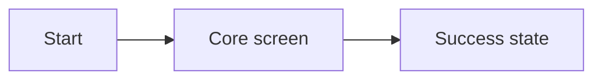

# Prototype Design

## Output Language

All user-facing output and every prototype document produced by this skill must use the language requested by the user. If no language is specified, use the language of the user's request. Translate headings, labels, prompts, diagrams, and visible prototype copy; keep code, paths, identifiers, commands, and required proper names unchanged.

## Purpose

Create a working visual prototype that users can see and click before the product idea, screen flow, or visual direction is finalized. The output is a reviewable concept for feedback, not a production implementation, Figma file, or final design specification.

## Workspace structure

Create the following folder before starting the prototype:

```text
.codex/temp/prototype/YYYYMMDD-<short-prototype-name>/
├── prototype.md
├── screenshots/
└── src/
    ├── index.html
    ├── styles.css
    └── app.js
```

- Use the current date in `YYYYMMDD` format.
- Use a short, lowercase, hyphenated name.
- Write every generated section in the user's requested language, including document titles, headings, table headers, Mermaid labels, screenshot captions, visible UI copy, validation notes, assumptions, and feedback questions. Do not mix languages unless the user explicitly requests it or a technical identifier must remain unchanged.
- Do not overwrite an existing prototype folder. Create a new version or inspect the existing version's purpose first.

## Workflow

1. Extract the user goal, primary action, success state, and required screens from the idea. Make reasonable assumptions and label them; keep the scope limited to what is needed to show the concept.
2. Create the dated workspace, `src`, and `screenshots` directories.
3. Write `prototype.md` with the screen inventory, Mermaid flow, design goals, visual direction, assumptions, and feedback questions.
4. Build a minimal clickable prototype with `src/index.html`, `styles.css`, and `app.js`. Use mocked state for backend, authentication, payment, or persistence instead of implementing real services.
5. Start a static server:

   ```powershell
   python -m http.server 4173 --directory .codex/temp/prototype/YYYYMMDD-<name>/src
   ```

   The server may also be started with the prototype folder as the working directory. Open the prototype at `http://localhost:4173`, not with `file://`.

6. Open the URL in the in-app browser and verify the actual layout and primary interactions. Click through screen transitions, menus, buttons, forms, and any empty, error, loading, or success states needed for user feedback.
7. Save screenshots for every meaningful page and state transition in `screenshots/`, then embed them in `prototype.md` with relative paths. If the environment cannot save browser screenshots as files, use the available browser capture result and document the capture limitation.
8. Finish the document with the local URL, verified interactions, known limitations, and focused questions for the user.

## Root document format

Use this structure for `prototype.md`, translating every heading, table label, Mermaid label, caption, and explanatory sentence into the user's requested language:

```md
# <Prototype name>

## At a glance
Explain in one paragraph what decision or experience this prototype is meant to evaluate.

## Design goals
- What the user should understand or decide
- The highest-priority experience goals

## Screen inventory
| ID | Screen | Role | Primary action |
|---|---|---|---|

## Page and user flow


## Visual direction
Describe layout, hierarchy, color mood, typography, and interaction intent.

## Screen concepts
### <Screen name>
Explain what the screen shows and why it exists.


## State changes
Describe the condition for each change and include before/after captures when useful.

## How to review
- URL: http://localhost:4173
- Verified interactions:

## Assumptions and limitations

## Feedback questions
```

Use clear page names and user actions in Mermaid labels. When there are three or more screens, show the primary flow and meaningful branches or state changes. Screenshots should help the user judge layout and behavior, not merely decorate the document.

## Implementation rules

- Make screen roles explicit with `data-screen` attributes or descriptive classes, even for a single-page prototype.
- Make the primary flow clickable with JavaScript state transitions.
- Make the concept feel realistic without hiding that data is mocked. Never include API keys, secrets, or real personal information.
- Include responsive behavior, keyboard focus, and relevant disabled, loading, success, empty, or error states when they affect the design decision.
- Use external libraries only when they materially accelerate the concept. Keep the base screen understandable if a CDN dependency is unavailable.
- Do not only list color codes. Show where each color is used and explain its intent in the document.
- Before the prototype is approved, do not expand the task into production code, Figma files, Figma edits, or Figma interactions.

## Completion checklist

- [ ] A root document exists under `.codex/temp/prototype/YYYYMMDD-<name>/`.
- [ ] The root document contains design goals, visual direction, and a Mermaid page/flow diagram.
- [ ] `src/index.html`, `src/styles.css`, and `src/app.js` exist and load in a browser.
- [ ] The prototype was served through a Python HTTP server on localhost.
- [ ] The primary flow was clicked through in the in-app browser.
- [ ] Screenshots for each major page and necessary state change are embedded in the document.
- [ ] Assumptions and focused feedback questions are recorded.
