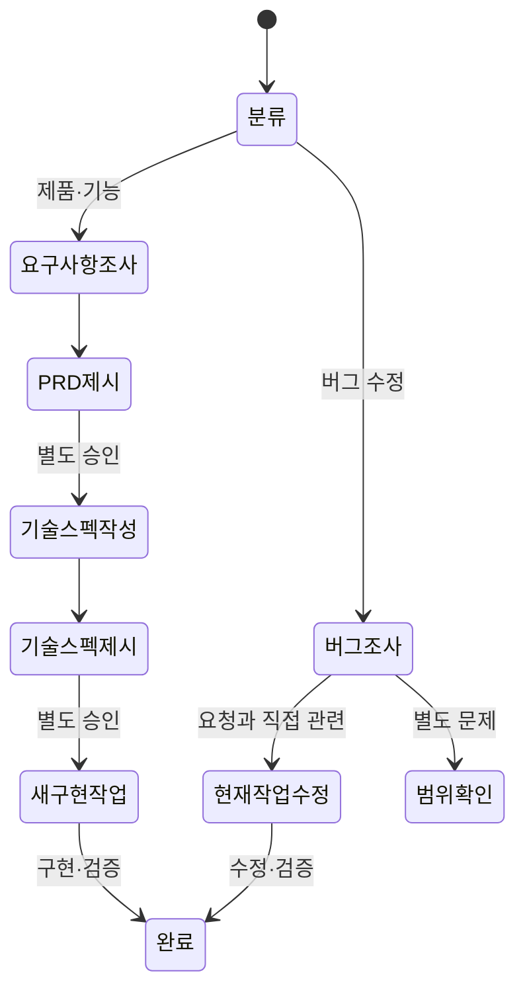

# Codex 워크플로우 플러그인 1.2.1 설계

## 배경

1.0 흐름은 문서와 승인 턴을 줄이기 위해 기능 구현과 버그 수정을 모두 조사 후 같은 작업에서 실행하도록 합쳤다. 기능 설계에서는 사용자가 제품 범위와 기술 계약을 확인할 지점이 사라졌고, 버그 조사에서는 관련 없는 발견까지 실행 권한으로 오해할 여지가 생겼다.

진짜 문제는 문서 수가 아니라 불확실성이 다른 기능 개발과 버그 수정을 같은 승인 흐름으로 처리한 것이었다.

## 설계 축

`구현 전에 사용자가 제품·기술 결정을 확인해야 하는가`를 핵심 축으로 삼는다.

- 기각: 모든 수정·구현 요청을 조사 후 같은 작업에서 실행한다. 관련 버그에는 빠르지만 신규 기능의 제품·기술 결정을 사용자가 확인하지 못한다.
- 채택: 제품·기능은 0.9.0의 PRD·기술 스펙 단계 승인을 복원하고, 버그는 요청 증상과 직접 관련된 범위만 조사 후 같은 작업에서 수정한다.

## 상태 모델



## 문서 구조

```text
.codex/temp/
├── YYYYMMDD-HHMM-<type>-<topic>-workflow.md
├── <product>-prd.md
├── <product>-technical-spec.md
└── <product>-ui-spec.md
```

- 작업 문서는 조사 결과, 열린 질문, 결정과 제외 방향을 누적한다.
- PRD는 제품 목적, 범위, 기능 요구사항과 수용 기준을 결정한다.
- 기술 스펙은 승인된 PRD를 구현 계약과 검증 기준으로 구체화한다.
- UI 문서는 화면 흐름, 에셋, 상태와 구현 기준을 한 파일에 둔다.
- 경로, 버전 또는 상태, Git 변경 상태와 의미 검증을 기본 동일성 확인으로 사용한다. 외부 계약이 요구할 때만 전체 SHA-256을 사용한다.

## 승인 정책

| 행동 | 승인 정책 |
| --- | --- |
| 제품·기능 추가·구현 | PRD 제시 후 별도 기술 스펙 승인, 기술 스펙 제시 후 별도 구현 승인 |
| 요청된 버그 수정 | 요청 증상과 직접 관련된 원인 및 필수 변경만 조사 후 같은 작업에서 실행 |
| 조사 중 발견한 별도 버그·독립 리팩터링·새 기능 | 수정 전에 범위 확장 승인 |
| UI 구현 | UI 스펙/구현 문서 제시 후 별도 구현 승인 |
| 삭제·배포·외부 전송·결제·권한·비가역 변경 | 행동 직전에 대상과 영향 승인 |

## 구현 인계

승인된 기술 스펙 또는 UI 구현 문서를 새 Codex 작업의 기준으로 사용한다. 새 작업을 만들기 직전에 문서를 파일에서 다시 읽고 범위, 비범위, 구현 단계와 검증 기준을 프롬프트에 포함한다. 모델과 추론 강도는 사용자가 지정한 값을 우선하며, 지정하지 않은 경우 현재 도구가 지원하는 선택지를 제시해 확인한다.

버그 수정은 별도 구현 문서나 새 작업을 기본 게이트로 사용하지 않는다. 원인과 필수 변경이 요청 증상에 직접 연결되는지 확인한 뒤 현재 작업에서 수정·검증한다.

## 관련 자료

- 현재 계약 요약: `plugins/codex-workflow/references/workflow-plugin-design.md`
- 1.0.0 단일 프롬프트 문서 설계의 역사적 근거: `plugins/codex-workflow/references/prompt-document-management.md`
