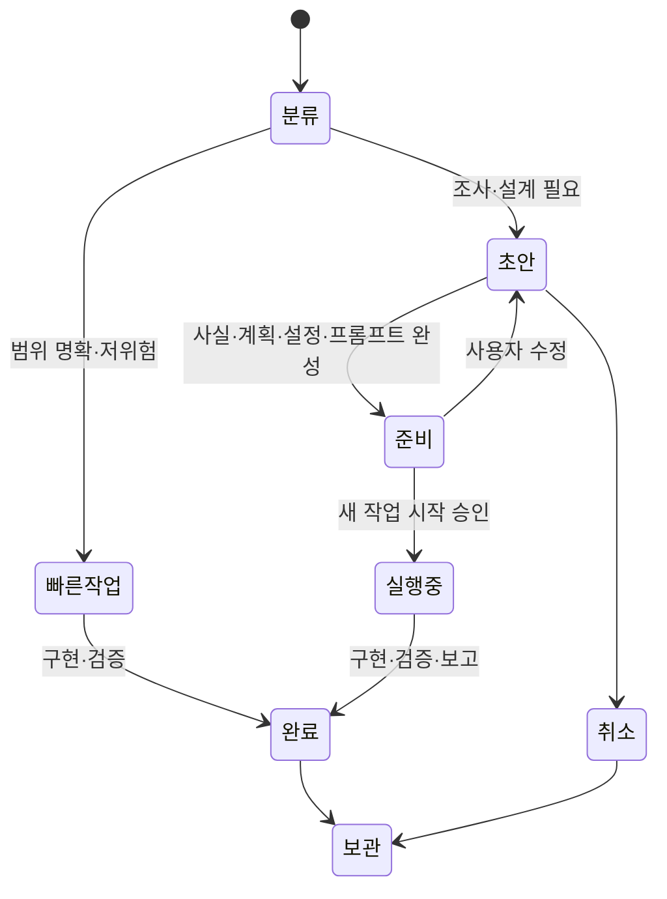
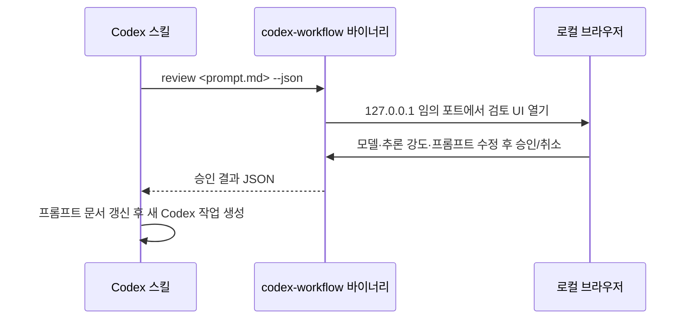

# Codex 워크플로우 플러그인 1.0.0 설계

## 배경

0.x 흐름은 사용자의 의도를 정교하게 고정하려고 PRD, 기술 스펙, 감사 보고서와 임시 작업 문서를 순서대로 만들었다. 작업마다 문서 수와 승인 턴이 늘었고, 간단한 수정도 같은 절차를 거쳤다.

진짜 문제는 문서 양 자체보다 한 작업의 실행 진실과 승인 상태가 여러 파일에 중복된 것이었다.

## 설계 축

`한 작업의 실행 진실이 몇 군데에 흩어지는가`를 핵심 축으로 삼는다.

- 기각: PRD와 기술 스펙을 유지한 채 폴더만 정리한다. 중복 상태와 승인 체인은 남는다.
- 채택: 빠른 작업은 문서 없이 수행하고, 계획 작업은 작업당 권위 문서 하나를 갱신한다.

## 상태 모델



## 문서 구조

```text
.codex/prompts/
├── README.md
├── active/<slug>.md
├── supporting/<slug>/<explicit-doc>.md
└── archive/YYYY/<slug>.md
```

- 카탈로그는 링크와 최소 패싯만 보존한다.
- 프롬프트 문서는 사실, 조건, 결정, 계획, 검증, 모델, 추론 강도, 프롬프트와 결과를 함께 가진다.
- PRD와 기술 스펙은 명시 요청이나 장기 공개 계약이 있을 때만 보조 문서로 만든다.
- 감사 발견은 별도 보고서보다 프롬프트 문서에 흡수한다.
- 여러 작업에서 장기 재사용할 아키텍처 결정만 ADR로 승격한다.

## 승인 정책

| 행동 | 승인 정책 |
| --- | --- |
| 명확한 저위험 수정·테스트 | 현재 사용자 요청을 실행 권한으로 인정 |
| 실행 프롬프트 조사·문서 작성 | 별도 승인 없음 |
| 새 Codex 작업 생성 | 계획·모델·추론 강도·프롬프트를 한 번 검토 후 명시적 시작 요청 |
| 삭제·배포·외부 전송·결제·권한·비가역 변경 | 행동 직전에 대상과 영향 승인 |

## Codex 전용 차이

Plannotator `setup goal`의 검증 가능한 팩트 구조는 사용하지만 산출 파일과 고정 승인 게이트는 복제하지 않는다. Codex용 실행 프롬프트는 실행 모델, 추론 강도, 선택 사유와 새 작업에 그대로 전달할 프롬프트를 포함한다. 사용자는 실행 전 모델과 추론 강도를 수정할 수 있다.

새 작업 도구가 있으면 승인된 설정으로 작업을 만들고 첫 진행 상태를 확인한다. 도구가 없거나 실패하면 모델, 추론 강도, 사유와 완전한 프롬프트를 코드 블록으로 출력한다.

## OS별 바이너리

프롬프트 검토는 Go로 작성한 `codex-workflow` 단일 바이너리가 담당한다.



- 지원 대상: Windows, macOS, Linux의 x64와 arm64
- 배포 형식: 실행 파일 6개와 파일별 SHA-256 sidecar
- 설치: `scripts/install.sh`, `scripts/install.ps1`
- 릴리스: `.github/workflows/release-binaries.yml`이 tag `v*`에서 교차 컴파일·smoke test·GitHub Release 업로드 수행
- 보안: loopback 바인딩, 세션별 무작위 URL 토큰, 2 MiB 요청 제한, 외부 UI 자산 없음
- fallback: 바이너리가 없으면 채팅에서 동일한 계획·모델·추론 강도·프롬프트를 검토

## 레퍼런스

상세 조사와 출처는 `plugins/codex-workflow/references/prompt-document-management.md`를 따른다.
