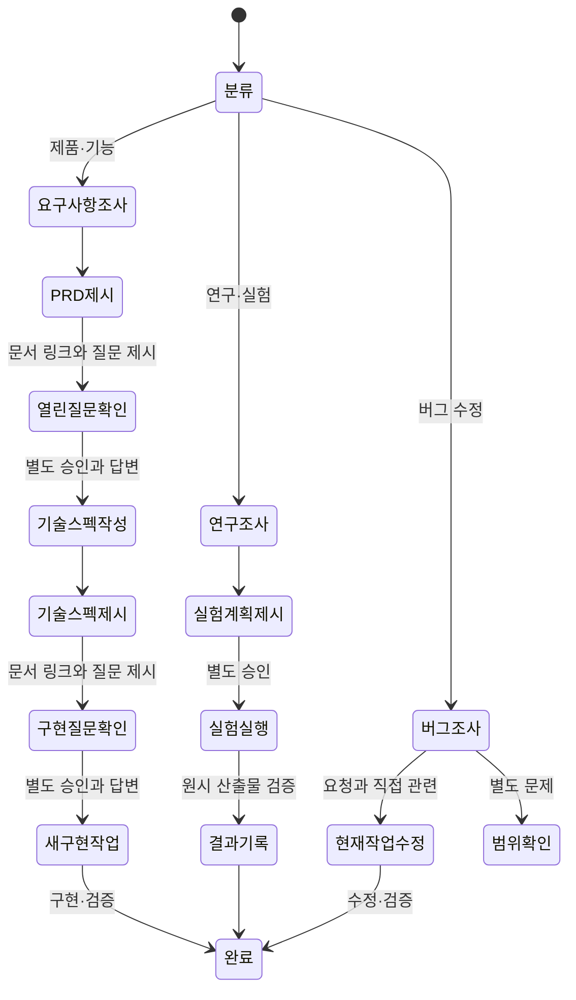

# Codex 워크플로우 플러그인 1.6.0 설계

## 패키지 표준

1.6.0은 Agent Plugins 1.0.0을 대상으로 한다. 플러그인 루트의 `plugin.json`이 패키지 식별과 버전을 선언하고, `skills/`와 `mcp.json`은 표준 고정 위치에서 발견된다. 레거시 Codex 전용 `.codex-plugin/plugin.json`과 `.mcp.json`은 사용하지 않는다.

`plugin.json`에는 이식 가능한 핵심 메타데이터만 둔다. 클라이언트 전용 표시 정보와 구성 요소 경로는 표준 최상위 필드가 아니므로 선언하지 않는다. MCP 서버는 `mcp.json`의 `mcpServers` 아래에서 `stdio` 전송을 명시하며, `${PLUGIN_ROOT}`를 사용해 설치 위치와 무관하게 서버 파일을 찾는다.

## 배경

1.0 흐름은 문서와 승인 턴을 줄이기 위해 기능 구현과 버그 수정을 모두 조사 후 같은 작업에서 실행하도록 합쳤다. 기능 설계에서는 사용자가 제품 범위와 기술 계약을 확인할 지점이 사라졌고, 버그 조사에서는 관련 없는 발견까지 실행 권한으로 오해할 여지가 생겼다.

진짜 문제는 문서 수가 아니라 불확실성이 다른 기능 개발과 버그 수정을 같은 승인 흐름으로 처리한 것이었다.

## 설계 축

`작업의 불확실성이 제품 결정, 연구 판정, 오류 원인 중 어디에 있는가`를 핵심 축으로 삼는다.

- 기각: 모든 수정·구현 요청을 조사 후 같은 작업에서 실행한다. 관련 버그에는 빠르지만 신규 기능의 제품·기술 결정을 사용자가 확인하지 못한다.
- 채택: 제품·기능은 0.9.0의 PRD·기술 스펙 단계 승인을 복원하고, 버그는 요청 증상과 직접 관련된 범위를 조사해 별도 승인받은 뒤 같은 구현 단위에서 수정한다.
- 채택: 연구·실험은 제품 문서와 분리해 가설·비교·판정 계약을 사전등록하고, 별도 승인 후 실행한 뒤 결과와 교훈을 기록한다.

## 상태 모델



## 문서 구조

```text
.codex/temp/
├── YYYYMMDD-HHMM-<type>-<topic>-workflow.md
├── <product>-prd.md
├── <product>-technical-spec.md
├── <product>-ui-spec.md
├── YYYYMMDD-HHMM-research-<topic>-experiment-plan.md
└── YYYYMMDD-HHMM-research-<topic>-experiment-result.md
```

- 작업 문서는 조사 결과, 열린 질문, 결정과 제외 방향을 누적한다.
- PRD는 제품 목적, 범위, 기능 요구사항과 수용 기준을 결정한다.
- 기술 스펙은 승인된 PRD를 구현 계약과 검증 기준으로 구체화한다.
- UI 문서는 화면 흐름, 에셋, 상태와 구현 기준을 한 파일에 둔다.
- 연구 계획은 가설, 비교군, 통제 변수, 계보, 실행·평가 설계와 사전 판정 기준을 고정한다.
- 연구 결과는 계획 대비 실제 실행, 관측값, 판정과 다음 실험에 재사용할 교훈을 기록한다.
- 경로, 버전 또는 상태, Git 변경 상태와 의미 검증을 기본 동일성 확인으로 사용한다. 외부 계약이 요구할 때만 전체 SHA-256을 사용한다.

## 승인 정책

문서 기반 단계 전환에서는 다음 단계를 막는 열린 질문을 문서 안에만 남기지 않는다. 문서 링크와 질문 전문·선택지·권장안·영향을 대화에 제시한 뒤 답을 받는다. 일반 `승인`은 권장안 선택으로 확대하지 않으며, 사용자가 먼저 승인했다면 승인 상태를 보존한 채 미제시·미응답 질문만 추가로 확인한다.

열린 질문이 모두 해결되어 승인·취소만 남은 단계는 `show_workflow_confirmation`으로 인라인 카드를 요청한다. 카드는 표시된 제목과 설명에서 후속 메시지를 결정적으로 만들며, MCP Apps UI를 렌더링하지 않는 호스트에서는 같은 내용을 텍스트로 제시한다. 이 카드는 Codex 네이티브 보안 승인을 대체하지 않는다.

모든 구현·수정 요청은 최초 요청과 실행 승인을 분리한다. 사용자가 `이 방식으로 하죠`, `구현해줘`, `고쳐줘`, `바로 진행해줘`라고 말해도 먼저 변경 파일·동작·검증·제외 범위를 제시하고 구현 승인 카드를 호출한 뒤 턴을 끝낸다. 카드의 후속 승인 메시지 또는 범위를 지목한 별도 구현 승인 메시지를 받은 다음 턴부터 구현한다.

| 행동 | 승인 정책 |
| --- | --- |
| 제품·기능 추가·구현 | PRD와 필수 열린 질문 제시 후 별도 승인·답변, 기술 스펙과 필수 열린 질문 제시 후 별도 승인·답변 |
| 연구 가설·실험 | 사전등록 계획 제시 후 별도 실행 승인, 원시 산출물 검증 후 결과·교훈 기록 |
| 요청된 버그 수정 | 요청 증상과 직접 관련된 원인 및 필수 변경만 조사 후 같은 작업에서 실행 |
| 조사 중 발견한 별도 버그·독립 리팩터링·새 기능 | 수정 전에 범위 확장 승인 |
| UI 구현 | UI 스펙/구현 문서 제시 후 별도 구현 승인 |
| 삭제·배포·외부 전송·결제·권한·비가역 변경 | 행동 직전에 대상과 영향 승인 |

## 구현 인계

승인된 기술 스펙 또는 UI 구현 문서를 새 Codex 작업의 기준으로 사용한다. 새 작업을 만들기 직전에 문서를 파일에서 다시 읽고 범위, 비범위, 구현 단계와 검증 기준을 프롬프트에 포함한다. 모델과 추론 강도는 사용자가 지정한 값을 우선하며, 지정하지 않은 경우 현재 도구가 지원하는 선택지를 제시해 확인한다.

승인된 연구 실험 계획은 현재 작업에서 실행하되, 사용자가 별도 새 Codex 작업 인계를 명시적으로 승인한 경우에만 새 작업으로 넘긴다. 어느 실행 단위에서도 계획의 고정 입력, 실행 순서, 성공·실패·차단 기준과 산출물 경로를 유지하며, 결과를 본 뒤 계획을 소급 변경하지 않는다.

버그 수정은 별도 구현 문서나 새 작업을 기본 게이트로 사용하지 않는다. 원인과 필수 변경이 요청 증상에 직접 연결되는지 확인한 뒤 현재 작업에서 수정·검증한다.

## 관련 자료

- 현재 계약 요약: `plugins/codex-workflow/references/workflow-plugin-design.md`
- 1.0.0 단일 프롬프트 문서 설계의 역사적 근거: `plugins/codex-workflow/references/prompt-document-management.md`
